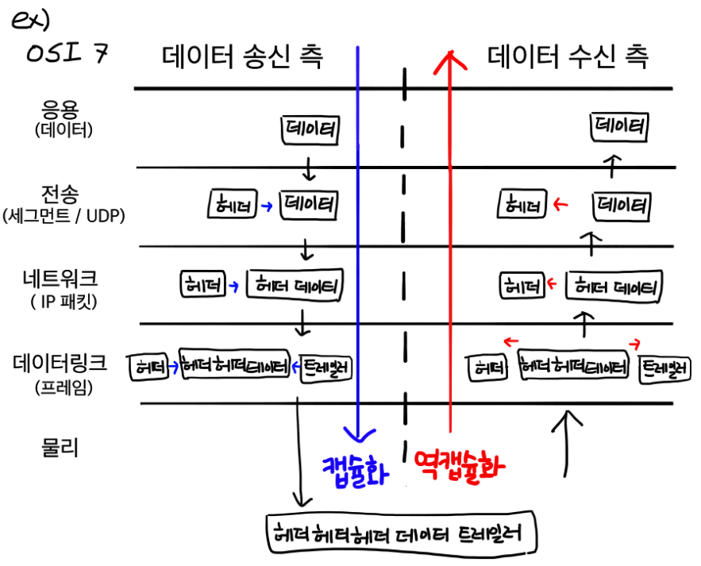

# 웹 통신의 큰 흐름

### Domain Name
도메인 네임이란 12자리의 숫자로 이뤄진 IP 주소를 문자로 표현한 것이다.

### DNS(Domain Name System)
`DNS` 는 **도메인 네임 과 이에 해당하는 IP 주소 값을 한 쌍으로 저장**하고 있는 데이터베이스이다.

- 도메인 네임은 사람의 편의성을 위해 만든 주소이다. 따라서 도메인 네임을 컴퓨터가 이해할 수 있는 IP 주소로 변환하는 작업이 필요하다. 이 때 사용하는 게 DNS라는 데이터베이스이다.

## 동작 원리

### 1. URL(www.google.com)을 브라우저 주소창에 친다.
- URL에 입력된 값을 브라우저 내부에 결정된 규칙에 따라 파싱하여 의미를 조사한다.
- URL 구조
    - protocol/name of site/ abolute path

### 2. 브라우저는 캐싱된 DNS 기록을 통해 URL(www.google.com)에 대응되는 IP 주소의 존재 유무를 확인한다
- 브라우저는 DNS 기록을 **4가지 캐시**에서 확인한다.

- 브라우저 캐시
    - 브라우저에 일정 기간동안 DNS 기록을 저장하고 있다.
    - DNS 쿼리는 이곳에서 가장 먼저 실행된다.
- OS 캐시
    - 브라우저 캐시에서 www.google.com의 IP 주소가 발견되지 않았다면, 브라우저는 시스템콜을 통해 OS가 저장하는 DNS 기록 캐시에 접근한다.
- 라우터 캐시
    - OS 캐시에서도 찾지 못했다면, 브라우저는 DNS 기록을 캐싱하는 라우터와 통신하여 IP 주소를 탐색한다.
- ISP 캐시
    - 라우터 캐시에도 찾지 못했다면, ISP 캐시에서 IP 주소를 탐색한다.
    - ISP는 DNS 서버를 구축하고 있다.
    - 여러 곳에서 DNS 캐시를 저장하여 네트워크 트래픽을 조절하고 데이터 전송시간을 줄여준다.

### 3. 4가지 DNS 캐시에서 IP 주소를 찾지 못하면, ISP의 DNS 서버가 DNS 쿼리를 날려 IP 주소를 얻는다.
- DNS query(DNS Request라고도 불림)란 DNS Client에서 DNS 서버로 전송되는 쿼리이다.
- DNS query의 목적은 여러 다른 DNS 서버들을 검색하여 해당 사이트의 IP를 찾는 것이다.
- IP 주소를 못찾아서 오류 응답을 반환할때까지 DNS 서버에서 다른 DNS 서버를 오고가며 반복적으로 검색을 진행하기 때문에 이러한 검색을 `Recursive Search` 라고 부른다.

> Recursive Search 과정 (www.google.com)

1. `DNS Recursor`가 `Root DNS Server(.)`에 DNS query를 날린다.
2. `Root DNS Server(.)`는 호스트 네임에 대한 IP 주소를 모르기 때문에 `Top-Level DNS Server(.com)` 로 Redirect한다.
3. `Top-Level DNS Server(.com)`도 모르기 때문에 `Second-Level DNS Server`(google.com)로 Redirect한다.
4. `Second-Level DNS Server(google.com)` 는 `www.google.com`의 DNS 레코드에서 `www.google.com`과 매칭되는 IP 주소를 찾아 `DNS Recursor`에게 반환한다.
5. `DNS Recursor` 는 찾은 IP 주소를 브라우저로 전송한다.

### 4. 브라우저는 웹 서버와 TCP connection을 수립한다.
ISP의 DNS 서버로부터 URL에 해당하는 서버의 IP주소를 받으면 서버와 데이터를 주고받기 위해 TCP connection을 수립하게 된다.

- TCP는 가상 회선 방식을 통해 데이터 발신지와 수신지 사이의 논리적인 경로를 배정하는 프로토콜로 HTTP 요청의 경우 일반적으로 TCP를 사용한다.

### 5. 브라우저가 웹 서버로 HTTP Request Message를 보내고, 웹 서버는 브라우저에게 HTTP Response Message를 보낸다.
TCP connection이 수립되었다면 클라이언트는 HTTP 요청 메시지를 전송할 수 있다.

- `캡슐화`란 응용 계층부터 물리 계층까지 각 계층별로 데이터를 전달할 때, 헤더를 붙여 전달하는 과정이다.
- `역캡슐화`란 물리 계층부터 응용 계층까지 데이터를 전달할 때, 헤더를 제거하며 전달하는 과정이다.

캡슐화와 역캡슐화 과정

> HTTP Request Message의 캡슐화

TCP connection이 확립되면 구글 서버 (IP주소)에 웹페이지를 요청하는 데이터를 보낸다. 데이터는 L7부터 L1까지(파란색 선) 각 계층마다 사용되는 프로토콜의 Header가 붙으며 캡슐화가 진행된다.

1. 응용 계층에서 데이터가 만들어지고 HTTP 헤더가 붙음
    - HTTP 헤더 + 데이터 = 메시지
2. 전송 계층에서 데이터에 TCP 또는 UDP 헤더가 붙음
    - TCP 헤더 + HTTP 헤더 + 데이터 = 세그먼트
    - TCP 헤더에 출발지 포트번호, 목적지 포트번호 정보가 있다
3. 네트워크 계층에서 데이터(세그먼트)에 IP 헤더가 붙음
    - IP 헤더 + TCP 헤더 + HTTP 헤더 + 데이터 = 패킷
    - IP 헤더에 출발지 IP 주소, 목적지 IP 주소 정보가 있다.
4. 데이터링크 계층에서 데이터(패킷)에 Ethernet 헤더가 붙음
    - Ethernet 헤더 + IP 헤더 + TCP 헤더 + HTTP 헤더 + 데이터 = 프레임
    - Ethernet 헤더에 목적지로 가기 위해 처음 거쳐야 할 라우터의 MAC 주소 정보가 있다.
5. 물리 계층에서 비트 데이터는 LAN 카드라는 장비를 거쳐 전기신호로 변환됨. 그리고 케이블과 물리적으로 연결된 스위치라는 장비로 전달됨

> 스위치 -> 최초의 라우터

데이터가 스위치에 도착하면 1계층 → 2계층 순서로 `역캡슐화` 가 진행된다.

1. 2계층까지 데이터(프레임)을 역캡슐화한다
2. Ethernet 헤더에서 목적지 라우터의 MAC 주소 정보를 알아낸다.
3. MAC 주소 테이블을 이용하여 데이터(프레임)를 보낼 포트를 조사한다
4. 다시 캡슐화하여 데이터(프레임)을 전기 신호로 변환하고 목적지로 가기 위해 처음 거쳐야 할 라우터로 전송한다

> 라우터에 도착한 데이터

데이터(프레임)가 라우터에 도착하면 1 → 2 → 3계층 순서로 역캡슐화가 진행된다

1. 2계층까지 데이터(프레임)을 역캡슐화한다
2. Ethernet 헤더속 목적지 라우터의 MAC 주소 와 해당 라우터의 MAC 주소를 비교한다
3. 같다면 3계층까지 역캡슐화한다
4. IP 헤더속 목적지 IP 주소를 알아내고, 해당 라우터의 라우팅 테이블을 기반으로 목적지 IP까지의 경로를 계산한다(라우팅)
    - 출발지 IP 주소가 사설IP 주소라면, IP 헤더속 출발지 IP주소를 공인IP주소로 수정한다
5. Ethernet 헤더의 목적지 라우터의 MAC 주소를 그 다음 hop의 라우터의 MAC 주소로 수정한다
6. 데이터를 캡슐화하여 다음 **hop의 라우터로 전송**한다

위와 같은 방식으로 목적지까지 여러 라우터를 거치며(그림에서는 2개의 라우터) **역캡슐화, 캡슐화 과정**을 반복한다

> 마지막 라우터에 도착한 데이터

마지막 라우터의 라우팅 테이블을 통해 목적지 IP 주소까지의 경로를 알 수 있다.

1. 3계층까지 역캡슐화하여 IP 헤더의 출발지 IP 주소를 해당 라우터 내부 IP 주소로 수정한다.
2. 2계층의 Ethernet 헤더의 MAC 주소를 서버측 스위치 주소로 수정한다
3. 데이터를 캡슐화하여 서버측 스위치로 전송한다

> 서버(목적지)측의 데이터 처리

1. 스위치는 1계층 → 2계층 순서로 역캡슐화하여 Ethernet 헤더의 MAC 주소가 자신의 것과 동일한지 확인한다. 동일하면 데이터를 캡슐화하고 전기신호로 변환하여 구글 서버로 전달한다.
2. 구글 서버의 물리 계층에서 전기 신호를 비트 데이터로 변환한다
3. 데이터링크 계층에서 역캡슐화하여 Ethernet 헤더의 목적지 MAC 주소와 구글 서버의 MAC 주소를 비교한다. 같다면 Ethernet 헤더 & 트레일러를 분리하고 네트워크 계층으로 전달한다
4. 네트워크 계층에서 IP 헤더의 목적지 IP 주소와 구글 서버의 IP 주소를 비교한다. 같다면 전송 계층으로 전달한다
5. 전송 계층에서 TCP 헤더의 목적지 포트번호에 해당하는 포트를 사용하는 어플리케이션을 확인한다. 만약 데이터에 오류가 있다면 송신측에 재전송을 요청한다.
6. 응용 계층에서 HTTP Request Message를 받고 HTTP Response Message를 생성하여 브라우저로 전송한다.

웹 서버에서 브라우저로 HTTP Response Message를 보내는 과정은 위와 역순으로 진행된다

