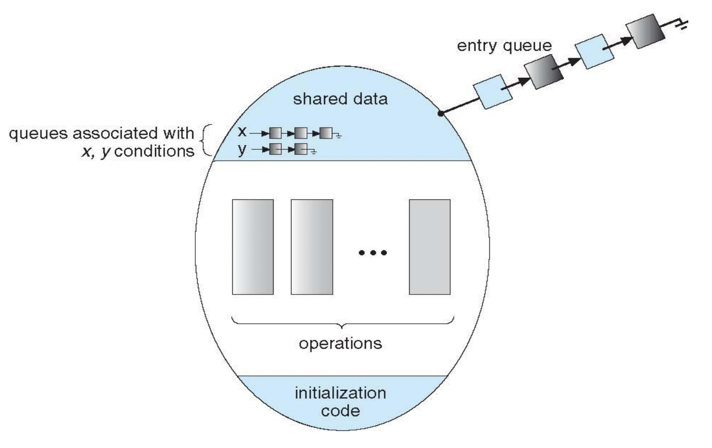

# Process_Synchronization
> 공유 데이터(Shared data)에 두 개 이상의 프로세스가 동시에 접근하면 data inconsistency가 발생할 수 있다. 

- 데이터 일관성 유지: 협력 프로세스들이 바른 순서로 실행(orderly execution)하는 것을 보장하는 매커니즘이 필요

  

# Race Condition
> 여러 개의 프로세스가 공유 자원에 접근하는 상황. 데이터의 최종 연산 결과는 마지막에 그 데이터를 다룬 프로세스에 따라 달라진다.

 

## Race Condition이 발생할 때
- kernel 수행 중 인터럽트 발생 시
- Process가 system call을 하여 kernel mode로 수행 중인데 context switch가 일어나는 경우
- Multiprocessor에서 shared memory 내의 kernal data

  

# Critical Region(Critical Section; CS)
> 프로세스(쓰레드)가 공유 자원을 변경할 수 있는 __코드 부분__

## Critical region 문제를 해결하기 위한 세 가지 조건

1. Mutual Exclusion(상호배제): 프로세스가 CS 부분을 수행 중이면 다른 모든 프로세스들은 그들의 CS에 들어가면 안된다.

2. Progress(진행): 아무도 CS에 있지 않은 상태에서 CS에 들어가고자 하는 프로세스가 있으면 CS에 들어가게 해주어야 한다.

3. Bounded Waiting(한정 대기): 프로세스가 CS 진입을 요청한 후에 요청이 허용될 때까지 다른 프로세스가 CS 진입이 허용되는 횟수에 제한이 있어야 한다. -> 그 어떤 프로세스도 CS 진입을 영원히 기다리지 않아야 한다.

 

# 해결책

> Higher-level software tools: Mutex Locks, Semaphores, Monitors 등

 

 # Mutex(Mutual Exclusion) Locks
 > CS에 들어가기전에 lock을 획득하고, 나올때는 lock을 반환한다.

- 특징

    

     

    - Locking 메커니즘으로 오직 하나의 프로세스나 스레드만이 동일한 시점에 mutex를 얻어 CS에 들어올 수 있다. 그리고 해당 프로세스나 스레드만이 CS를 벗어날 때 mutex를 해제할 수 있다.

    - acquire()과 release()는 atomic 해야한다.

    - Busy Waiting: CS에 들어가기 위해서 계속해서 acquire()를 호출하는 반복문을 실행한다. -> lock이 가용해지기를 기다리면서 프로세스가 계속 반복 회전하고 있기 때문에 spinlock이라고 부르기도 한다.

    - but 멀티프로세서 시스템에서 프로세스가 계속 일을 하고 있기 때문에 Context Switching을 할 필요가 없다는 것은 장점이 될 수도 있다. -> 프로세스들이 짧은 시간 동안 Lock을 소유하는 경우라면 mutex가 유용하게 사용될 수 있다.

     

    - Busy Waiting이 없는 Mutex Lock: Test and Set을 사용
        - Test and Set: 하드웨어적으로 atomic하게 수행할 수 있도록 한다.
        - lock을 획득하지 못하면 프로세스는 lock을 기다리는 대기상태로 전환하고 CPU를 내어 놓음

 

# Semaphore(세마포어)

- semaphore S: 사용 가능한 특정 자원의 개수

- Semaphore 연산
    - P operation(wait(S), acquire(S))
    - V operation(signal(S), release(S))

    

- Signaling 메커니즘으로 lock을 걸지 않은 스레드도 Signal을 보내 lock을 해제할 수 있다.

- 용도

    - 상호 배제(mutual exclusion) -> binary semaphore
    - 유한 개수의 자원 접근, 한정된 concurrency -> counting semaphore

## Binary semaphore(mutex lock과 유사)

- semaphore 값: 0 또는 1(1로 초기화); S=1: unlock, S=0: lock

- 임계구역 접근 제어에 사용

## Counting Semaphore(한정된 concurrency, 유한 개수 자원 접근)

- semaphore 값: 가용 자원 개수를 의미(최대 가용 자원 개수로 초기화)
- 유한 개수의 자원의 접근 제어에 사용
- Busy Waiting이 있다.(spin lock)

  

- semaphore를 이용한 동기화

 

### Semaphore 구현
- Busy Waiting이 있는 Semaphore

- Busy Waiting이 없는 Semaphore

- Block & Wakeup 방식(sleep lock)
- semaphore 값을 먼저 감소 -> 음수가 가능하다.
- 음수의 크기는 semaphore를 대기하는 프로세스들의 개수이다.
- 두 프로세스가 같은 semaphore에 대해 P 또는 V 연산이 중첩되어 실행되지 않도록 해야한다.(atomic 실행)

  

# Monitor
> 상호 배제를 제공해주는 __고수준의 동기화 추상화 데이터형(ADT)__

 

 

- semaphore의 단점을 극복. ex) wait()와 signal() 연산의 순서 오류가 있을 수 있다.
- monitor 안에는 shared data와 공유 데이터에 접근하는 procedure를 정의해두고 해당 shared data는 procedure를 통해서만 접근 가능하다.
- monitor는 기본적으로 내부의 procedure들은 동시에 실행할 수 없도록 한다.
- monitor 내에서는 한번에 하나의 프로세스만이 활동 가능하다.
- 프로그래머가 lock을 걸 필요가 없다. vs semaphore
- condition variable(프로세스가 monitor 안에서 기다릴 수 있도록 해준다.)이 사용된다. -> wait()와 signal() 연산에 의해서만 접근 가능
    - wait() 를 호출한 연산은 프로세스는 다른 프로세스가 signal() 을 호출할 때까지 일시 중지(suspend) 된다.
    - signal() 연산은 정확히 하나의 프로세스만 재개시킨다. 일시 중지된 프로세스가 없으면 아무런 영향이 없다.