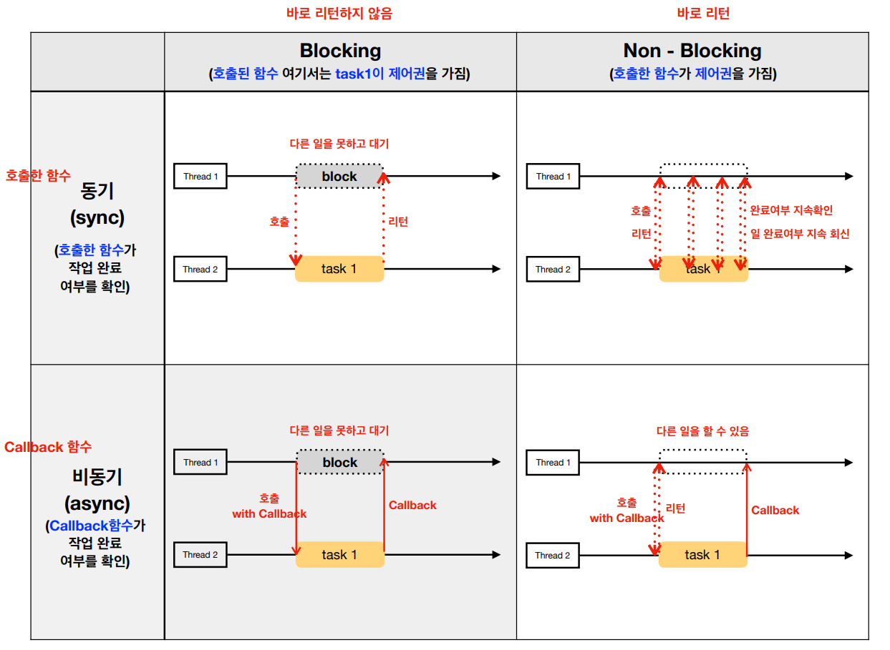

# 동기와 비동기 & 블로킹과 논블로킹

## 동기 & 비동기

> 조건

동기 & 비동기는 작업을 수행하는 주체가 2개 이상이여야 한다.

> 관점

처리해야 할 작업들을 어떠한 “흐름”으로 처리 할 것인가에 대한 관점

> 동기와 비동기를 나누는 기준

호출되는 함수의 작업 완료 여부를 신경쓰는지에 대한 차이

- 동기 : 함수를 호출한 주체는 해당 함수의 작업이 **완료되었는지 확인**한다.
- 비동기 : 함수를 호출한 주체는 해당 함수의 작업 **완료 여부를 신경쓰지 않는다.**

### 동기 작업
- 동기식 작업이란 2개 이상의 주체가 `작업을 동시에 시작` , `작업을 동시에 종료` , `하나의 작업을 끝나는 동시에 다른 주체가 작업을 시작` 하는 식의 흐름으로 작업들을 처리한다.

- 시작 시간과 종료 시간을 맞춘(Synchronize) 경우

- ex) 프로그램 설치 작업과 설치경과를 Progress Bar로 표시하는 작업은 동시에 시작되고 동시에 끝난다. (동기 + 논블로킹 작업)

### 비동기 작업
- 비동기식 작업이란 2개 이상의 주제가 작업의 시작시간, 종료시간에 관계 없이 `각자 별도의 시작시간, 종료시간을 가지며` 작업들을 처리한다.

- 서로의 작업 순서가 크게 중요하지 않은 경우

- ex) html 파일을 화면에 그리는 작업과 img 태크에 이미지를 로드하는 작업 (비동기 + 논블로킹 작업)

## 블로킹 & 논블로킹

> 조건

블로킹 & 논블로킹은 작업의 대상이 2개 이상이여야 한다.

> 관점

처리되어야 하는 (하나의) 작업이, 전체적인 작업 흐름을 “막느냐 안막느냐”에 대한 관점

- 블로킹과 논블로킹을 나누는 기준 → 함수를 호출한 주체가 함수에게 제어권을 넘겨주는지

- 블로킹 : 함수를 호출한 주체가 제어권을 함수에게 넘겨주기 때문에 **호출한 함수의 작업 결과를 기다린다.** (호출된 함수는 작업을 마칠 때까지 제어권을 갖고 있는다)
- 논블로킹 : 함수를 호출한 주체가 **계속 해서 다른 작업을 수행한다.**

### 블로킹 작업
함수를 호출한 주체가 제어권을 함수에게 넘겨주면 호출된 함수가 작업을 완료하여 `결과를 반환하기까지 기다렸다가(blocked) 작업 결과를 반환`받으면 그제서야 작업을 이어간다.

ex) Java에서 JDBC를 사용하여 DB에 쿼리를 날리고 결과를 받아오는 작업

### 논블로킹 작업
작업을 수행하는 주체가 함수를 호출하여 다른 작업을 요청하고, 그 결과를 받을 때까지` 대기하지 않고 자신의 작업을 수행한다.`

## 비교

> 비동기 vs 논블로킹

- 비동기는 작업들을 처리할 때 서로의 시간을 맞추지 않는다.
- 논블로킹은 처리되어야 하는 하나의 작업이 전체 작업의 흐름을 막지 않는다.

> 동기 vs 블로킹

- 동기는 작업들을 처리할 때 서로의 시간을 맞춘다.
- 블로킹은 처리되어야 하는 하나의 작업이 전체 작업의 흐름을 막는다.

## 조합
### 동기&블로킹

> 동기

기능 A의 개발이 선행되어야 기능 B를 만들 수 있기 때문에 엔지니어A의 작업이 끝나는 동시에 엔지니어 B가 작업을 시작하도록 작업 흐름(순서)을 맞추어야 한다.

> 블로킹

엔지니어A가 기능A를 개발하는 동안 프로젝트의 진행이 멈춘다(blocked). 기능A를 모두 개발한 뒤에야 프로젝트가 진행된다.

### 동기&논블로킹
> 동기

기능A가 개발이 되어야 기능 B를 개발할 수 있다.

> 논블로킹

엔지니어A가 기능A를 개발하는 동안 프로젝트의 진행을 멈추지 않는다. 대신 기능A의 개발이 끝났는지 주기적으로 확인하는 작업(polling)을 한다.

### 비동기&블로킹(비효율)
작업의 흐름을 비동기로 설계했지만, 블로킹 때문에 동기 + 블로킹과 같은 흐름을 갖게 된다.

> 비동기

기능 A가 반드시 기능B보다 먼저 개발될 필요가 없다. 즉, 작업의 우선순위가 없다.

> 블로킹

엔지니어A가 기능A를 개발하는 동안 프로젝트 진행을 멈춘다. 그렇기 때문에 엔지니어B는 기능A의 개발이 완료되기 전까지 기능B를 개발할 수 없다

### 비동기 + 논블로킹 (효율)
성능과 자원의 효율면에서 가장 우수하여 많이 쓰이는 조합 중 하나이다.

> 비동기

기능 A가 반드시 기능B보다 먼저 개발될 필요가 없다.

> 논블로킹

엔지니어 A,B가 기능 A,B를 개발하는 동안 프로젝트는 계속 진행된다. 따라서 기능A를 개발하는 도중에 엔지니어B는 기능B를 개발할 수 있다.

