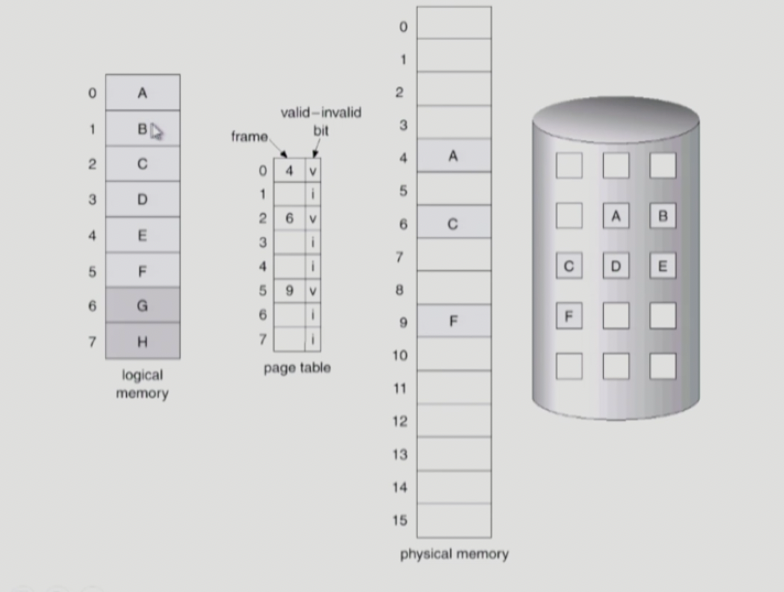
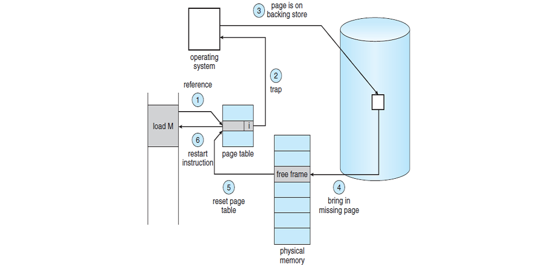

# Virtual_Memory(가상 메모리)
> 물리 메모리의 크기의 한계를 극복하기 위해 나온 기술. 

  

# Demanding Paging
> Page 단위에서 현재 필요한 페이지만 메모리에 올리는 것

- I/O 양의 감소
- Memory 사용량 감소
- 빠른 응답 시간
- 더 많은 사용자 수용

## Valid/Invalid bit
- Invalid
    - 사용되지 않는 주소 영역인 경우
    - 페이지가 물리적 메모리에 없는 경우
- 처음에는 모든 page entry가 invalid로 초기화
- address translation(주소 변환) 시에 invalid bit이 set 되어 있으면 __page fault__

 

## Page Fault
> CPU가 접근하려는 페이지가 메모리에 없는 경우. 페이지 테이블의 invalid bit가 set 돼있는 경우

1. 해당 페이지가 메모리에 있는지 valid bit를 확인한다.
2. invalid bit가 set된 경우라면 CPU에 인터럽트 신호를 보내 운영체제 내부 해당 ISR로 점프한다.
    1. invalid reference?(ex. bad address, protection violation) -> abort process.
    2. 물리적 메모리의 비어있는 프레임에 획득한다. (비어있는 프레임이 없으면 뺏어온다.:replace)
    3. 해당 페이지를 backing store(디스크)에서 물리적 메모리로 읽어온다.
        - disk I/O가 끝나기까지 이 프로세스는 CPU를 preempt 당한다.(block)
        - Disk read가 끝나면 page tables entry를 기록하고 valid/invalid bit를 'valid'로 설정한다.
        - ready queue에 process를 insert
    4. 해당 프로세스가 CPU를 잡고 다시 running
    5. 아까 중단되었던 instruction을 재개한다.

 

- Pure Demanding Paging

Pure Demanding Paging은 프로세스가 최초로 실행될 때는 어떤 페이지가 필요한지 알 수 없으므로, 아무 페이지도 올리지 않는다. 

그러므로 프로그램을 실행하자마자 page fault가 발생한다. 즉, 순수하게 필요한 페이지만 올리는 것을 말한다. 

Pure Demanding Paging의 장점은 메모리를 최대한 효율적으로 사용할 수 있다. 하지만 시작부터 page fault가 발생하므로 속도면에서 느리다.

 

## Free frame이 없는 경우(물리 메모리가 모두 사용중인 상황)

- Page replacement

    - 어떤 frame을 빼앗아올지 결정해야 함
    - 곧바로 사용되지 않을 page를 쫒아내는 것이 좋음
    - 동일한 페이지가 여러번 메모리에서 쫒겨났다가 다시들어올 수 있음

- Replacement Algorithm

    - page fault rate를 최소화하는 것이 목표
    - 알고리즘의 평가
        - 주어진 page reference string에 대해 page fault를 얼마나 내는지 조사

 

## 만약 victim page가 메모리에서 디스크로 올라온 이후에 내용이 변경되었다면?

쫒아내기만 하면 되는게 아니라 변경된 내용을 page-out이 될 때 backing store에 쓰기(write) 연산을 해야한다.

backing store는 읽는 시간도 느리지만, 거기에 더해 쓰기 작업까지 한다면 더욱 비효율적일 것이다.

그러면 해당 페이지가 수정되었는지 안되었는지를 판단할 수 있어야 하는데, 이를 위해 페이지 테이블에 modified bit(=dirty bit)를 추가하여 이를 검사한다.

해당 페이지가 수정되었다면 이 비트를 1로 두고, 수정되지 않으면 0으로 둔다. 이를 이용해서 victim page는 최대한 수정되지 않은 페이지를 선택한다.