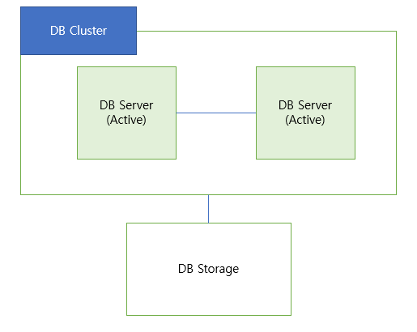
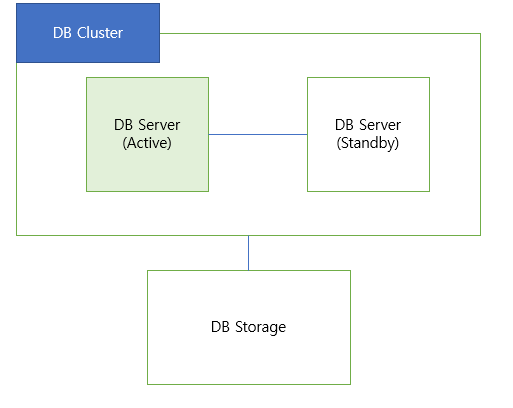
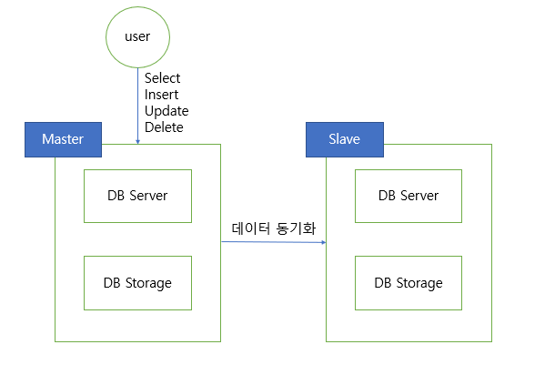
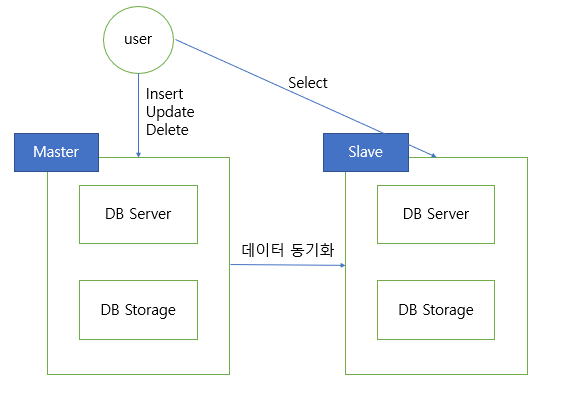
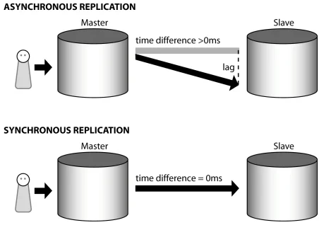
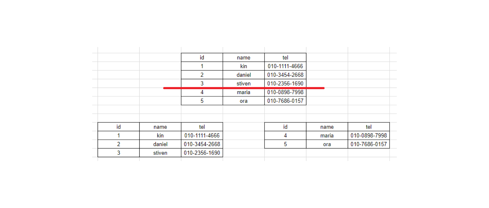
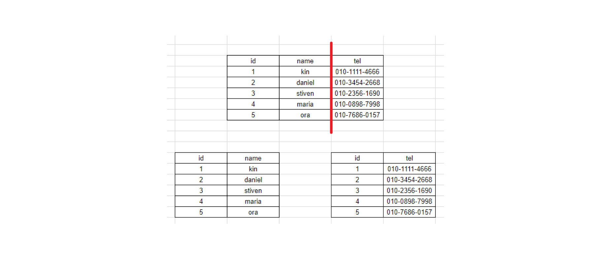
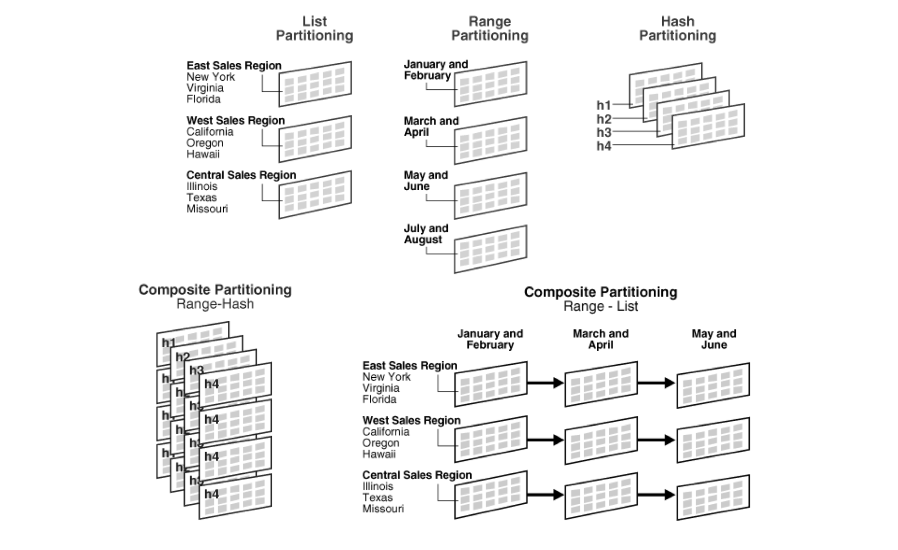

# Clustering & Replication & Sharding & Partitioning

 

## Clustering
> 데이터베이스 분산 기법 중 하나로 데이터베이스 서버를 여러개 두어 서버 한 대가 죽었을 때 대비할 수 있는 기법 (서버 다운)

1. Active - Active Clustering

> 

모든 데이터베이스 서버를 active 상태로 둔다.

__장점__
- 서버 하나가 죽더라도 다른 서버가 역할을 바로 수행할 수 있다.
- cpu와 메모리 이용률을 올릴 수 있다.

__단점__
- 저장소 하나를 공유하게 된다면 병목현상이 발생할 수 있다.
- 서버를 여러 대 한꺼번에 운영하기 때문에 비용이 발생한다.
치

 

2. Active - Standby clustering

> 

서버 하나만 운영하고 나머지 서버는 standby 상태로 둔다.
운영하고 있는 서버가 다운되면 standby를 active 상태로 전환한다.

__장점__
- 비용이 적게 든다.

__단점__
- 서버가 다운될 시 standby를 active로 전환하는데 시간이 오래걸린다.

  

## Replication

> 저장된 데이터가 손실될 때를 대비한다.

- 서버 - 클러스터링
- 데이터 손실 - 리플리케이션

1. 단순 백업

> 

- Master db에 crud 연산이 수행될 때마다 slave db에 로그를 전달하여 데이터 동기화하는 방식
- Master db가 손실되었을 때, slave를 master로 승격시킨다.

2. 부하 분산

> 

- 단순한 백업 모델에서 select 작업을 slave에서 수행함으로써 master db의 부하를 분산한다.

___Replication Lag과 데이터의 일관성___
Primary에서 Secondary로 데이터를 복제하는데 지연 시간을 `Replication Lag` 이라고 부른다.

이러한 문제를 해결하기 위해 동기와 비동기적으로 데이터의 복사가 이뤄지게 한다.

___동기 복사, 비동기 복사___

1. Synchronous Replication
- 사용자가 primary로 데이터 쓰기 요청을 보냈을 때, 요청한 내용에 대해 먼저 처리한 뒤에 응답을 보낸다.
- 속도가 느리지만 일관성 보장

2. Asynchronous Replication
- 사용자가 쓰기 요청을 보냈을 때, primary만 적용 후 응답 내용을 보내는 방식이다.
- 빠른 속도

  

## Partitioning
> 하나의 큰 테이블을 작은 단위로 나누어 관리하는 기법이다.

서비스의 크기가 점차 커짐에 때라 db에 저장되는 데이터의 규모 또한 비대해졌다. 이에 따라 성능 저하와 용량 문제에 직면하게 된다. 이러한 문제를 해결하기 위해 작은 단위로 나누어 관리하는 파티셔닝 기법이 나타나게 되었다. 파티셔닝은 소프트웨어적으로 데이터베이스를 분산 처리하여 성능을 개선한다.

__아리까리한 개념__
물리적인 데이터 분할이 이루어 져도 application 자체에서 이를 인식 할 수 없다. + 테이블과 index를 같이 분할해야 한다.

1. Horizontal Partitioning

> 
- 하나의 테이블을 각 행을 다른 테이블에 분산시키는 것이다.
- __샤딩__ 과 동일한 개념이다.
- 스키마를 복제한 후 샤드키를 기준으로 데이터를 나누는 것을 의미한다.
- 일반적으로 분산 저장을 한다고 한면 파티셔닝은 수평 분할을 의미한다.
- 수평 분할 또한 하나의 데이터베이스 안에서 이루어 지는 경우를 지칭한다.

__장점__
- 데이터의 개수를 기준으로 파티셔닝하기 때문에 데이터의 개수와 Index의 개수가 작아지기 때문에 성능이 향상된다.

__단점__
- 서버간의 연결 과정이 많다.
- 데이터를 찾는 과정이 복잡하기 때문에 지연시간이 존재할 수 있다.
- 하나의 서버가 고장나면 데이터의 무결성이 깨질 수 있다.

 

2. Vertical Partitioning

> 

- 테이블의 일부 열을 빼내는 형태로 분할한다.
- 특정 컬럼을 쪼개서 따로 저장하는 형태를 의미한다.
- 스키마를 나누고 데이터가 따라 옮겨가는 것을 말한다.
- 하나의 엔티티를 2개 이상으로 분리하는 작업
- rdb에서 제 3정규형과 같은 개념으로 이해하면 쉽다.
- 하지만 수직 파티셔닝은 이미 정규화된 데이터를 분리하는 과정이다.

__장점__
- 자주 사용하는 컬럼 등을 분리시켜 성능을 향상시킬 수 있다.
- 한 테이블을 select 하면 결국 모든 컬럼을 메모리에 올리게 되므로 필요없는 컬럼까지 올라가서 한 번에 읽을 수 있는 row가 줄어든다.

3. Partitioning의 분할 기준

> 

1. Range Partitioning
- 분할 키 값이 범위 내에 있는지 여부로 구분한다.

2. List Partitioning
- 값 목록에 파티션을 할당 분할 키 값을 그 목록에 비추어 파티션을 선택한다.

3. Hash Partitioning
- 해시 함수의 값에 따라 파티션에 포함할지 여부를 결정한다.

4. Composite Partitioning
- 위 기술을 결합하는 것을 의미하며, 범위 + 해시, 리스트 + 해시 이런식으로 사용할 수 있다.

  

## Sharding
> 같은 테이블 스키마를 가진 데이터를 다수의 데이터베이스에 분산하여 저장하는 방법 (Horizontal Partitioning)

보통은 application level에서 사용하지만 database level에서도 사용할 수 있다. 
빠른 성능을 보장하지만 한쪽으로만 데이터가 몰릴 수 있는 단점 또한 존재한다.

[샤딩 권장하지 않는다?!](https://www.itworld.co.kr/news/200134)

__Sharding 방법__
1. Hash Sharding(Modular Sharding)

해시 함수를 통해 shard key를 결정하는 방식이다. 모듈러 연산을 통해 진행하기 때문에 모듈로 샤딩이라고 부르기도 한다.

__장점__
- 간단하다.

__단점__
- shard가 늘어나면 기존에 저장된 데이터들에 대한 정합성이 깨진다.
- 공간 효율이 좋지 않다.

2. Dynamic Sharding
해시 샤딩 방식의 확장성 문제를 해결하기 위한 방법이다.
- Locator service라는 테이블 정보를 기반으로 Shard Key를 결정한다.

__장점__
- 확장성에 유연하다. 한 샤드 내에 데이터가 많아 지면 shard 정보만 추가하면 된다.

__단점__
- Locator Service에 의존적인 방식이다.

  

### 참고
[우리 꺼~ ㅎㅎ](CS/)
[Partitioning](https://gmlwjd9405.github.io/2018/09/24/db-partitioning.html)
[]