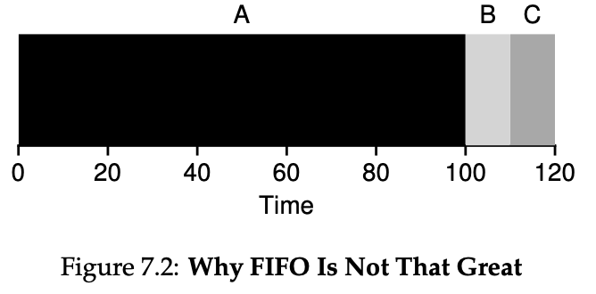
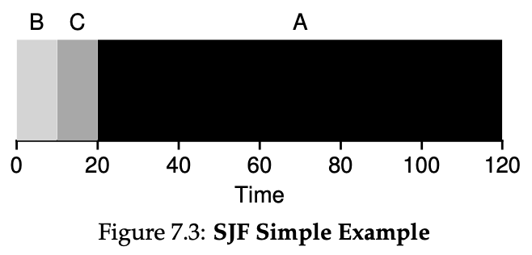
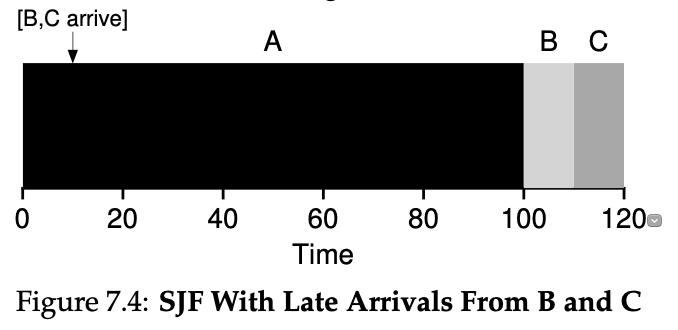
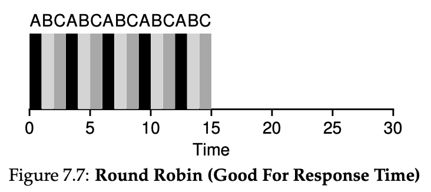

## cpu 스케줄링

- 다중 프로그래밍의 목적은 `cpu 이용률` 최대화 
- CPU를 사용하는 패턴이 상이한 여러 프로그램이 동일한 시스템 내부에서 함께 실행되기 때문에 효율적인 CPU 사용을 위해 필요하다.

> I/O bound process
`I/O 버스트`가 긴 프로세스 I/O요청이 빈번해 CPU 버스트가 짧게 나타나는 프로세스를 말한다. 주로 사용자로부터 interaction을 계속 받아가며 프로그램을 수행하는 대화형 프로그램이 이에 해당한다.

> CPU bound process
`CPU 버스트`가 긴 프로세스 I/O작업을 거의 수행하지 않아 CPU 버스트가 길게 나타나는 프로세스를 말한다. 주로 프로세스 수행의 상당 시간을 입출력 작업 없이 CPU 작업에 소모하는 계산 위주의 프로그램이 해당된다.

## cpu 스케줄러

- cpu가 유휴 상태(idle)가 될 때마다 운영체제는 ready queue의 프로세스 중 어떤 프로세스에게 cpu를 할당할지 결정하는 `운영체제의 코드`
- 일반적으로 ready queue에 저장되는 레코드는 PCB
- ready queue는 FIFO가 아닌 우선순위 큐, 트리 등 여러 구조를 띈다. 

> Ready Queue : 현재 메모리 내에 있으면서 CPU를 잡아서 실행되기를 기다리는 프로세스의 집합
> Job Queue : 현재 시스템 내에 있는 모든 프로세스의 집합

- **비선점형(nonpreemptive)**: CPU를 획득한 프로세스가 스스로 CPU를 반납하기 전까지는 CPU를 빼앗기지 않는 방법
- **선점형(preemptive)**: 프로세스가 CPU를 계속 사용하기를 원하더라도 강제로 빼앗을 수 있는 스케줄링 방법
  
### cpu 스케줄러가 필요한 경우
- `running -> watiting/Blocked` (비선점)
  - I/O 요청, 자식 프로세스의 조요를 기다리기 위해 wait() 호출 시
- `running -> ready` (선점)
  - 인터럽트 발생
- `waiting/Blocked -> ready` (선점)
  - I/O 종료
- `terminated` (비선점)
  - 프로세스 종료 

### 디스패처 (Dispatcher)
- 새롭게 선택된 프로세스가 CPU를 할당받고 작업을 수행할 수 있도록 환경설정을 하는 운영체제의 코드
- 디스패처는 스케줄러 이후에 실행되는 특수 프로그램이다. 
- CPU 코어의 제어를 CPU 스케줄러가 선택한 프로세스에 건내주는 모듈
- `디스패치 지연시간(dispatch latency)`
  - 디스패처가 하나의 프로세스를 정지시키고 다른 프로세스에게 CPU를 전달하기까지 걸리는 시간. 디스패치 지연시간은 문맥교환 오버헤드에 해당된다.

**기능**
- 컨텍스트 전환
- 사용자 모드로 전환
- 프로그램을 다시 시작할 때 사용자 프로그램의 적절한 위치로 이동하는 일

> 스케줄러 vs 디스패처
다양한 프로세스 중 프로세스를 **선택**하는 절차는 `스케줄러`에 의해 수행
스케줄러가 대기열에서 프로세스를 선택하면 `디스패처`가 준비대기열에서 해당 프로세스를 가져와 실행 상태로 이동시킨다. 

속성|디스패처|스케줄러
--|--|--
정의|단기 스케줄러가 선택한 프로세스에 cpu를 제어하는 모듈|다양한 프로세스 중에서 프로세스를 선택
유형|단지 코드이다|스케줄러는 장기,단기,중기 3가지 종류가 있다
의존|작동은 스케줄러에 따라 다르다. 디스패처는 스케줄러가 프로세스를 선택할때까지 기다려야한다|스케줄러는 독립적으로 작동한다. 필요할때 즉시 작동
연산|디스패처에는 구현을 위한 특정 알고리즘이 없다|스케줄러는 FCFS.SJF 등과 같은 다양한 알고리즘에서 작동한다
걸린시간|디스패처가 걸리는 시간을 디스패처 대기시간이라고 한다|스케줄러에 걸리는 시간은 일반적으로 무시할수있다.
기능|컨텍스트 전환, 사용자 모드로 전환, 프로세스가 다시 시작될때 적절한 위치로 점프|유일한 작업은 프로세스 선택
작업|단기 스케줄러가 선택한 프로세스에 CPU 할당한다|작업 스케줄링(장기),CPU 스케줄링(단기), 스와핑(중기)

## 스케줄링 성능 평가 (Scheduling Criteria)
스케줄링을 할때 고려해야 하는 것 

**시스템 입장**

- CPU Utilization(이용률)
  - 전체 시간 중에서 CPU가 일을 한 시간의 비율
- Throughput(처리량)
  - 주어진 시간동안 준비큐에서 기다리고 있느 프로세스 중 몇 개를 끝마쳤는지 나타낸다
  - 즉 CPU의 서비스를 원하는 프로세스 중 몇 개가 원하는 만큼의 CPU를 사용하고 이번 CPU 버스트를 끝내어 준비 큐를 떠났지 측정한 것이다.
  - 더 많은 프로세스들이 CPU 작업을 완료하기 위해서는 CPU 버스트가 짧은 프로세스에게 우선적으로 CPU를 할당하는 것이 유리하다.

**프로세스 입장**

- Turnaround time (소요시간, 반환 시간)
  - 반환 시간은 프로세스가 완료된 시간에서 프로세스가 도착한 시간을 뺀 시간
  - 즉 어떤 프로세스가 완료될 때까지 걸린 시간이다.
  - (준비 큐에서 기다린 시간) + (실제로 CPU를 사용한 시간)
- Waiting time(대기 시간)
  - CPU 버스트 기간 중 프로세스가 준비 큐에서 CPU를 얻기 위해 기다린 시간의 합을 뜻한다.
- Response time(응답 시간)
  - 프로세스가 준비 큐에 들어온 후 첫 번째 cpu를 획득하기까지 기다린 시간
  - 응답 시간은 대화형 시스템에 적합한 성능 척도로서, 사용자 입장에서 가장 중요한 성능 척도라고 할 수 있다.

## Scheduling Algorithms

### FCFS(First Come First Served) Scheduling
- 비선점
- CPU를 먼저 요청하는 프로세스에 먼저 CPU를 할당하고 FIFO 큐 를 사용하여 구현

**문제점**
- 성능면에서 그다지 효율적이지 않으며 대기 시간이 상당히 길다.
- FCFS는 `Convoy 효과` 를 겪는다.
> 다른 프로세스들이 하나의 긴 프로세스가 CPU를 놓기를 기다리는 것

> A, B, C가 모두 0초에 도착했고 도착시간이 동일하면 알파벳 순으로 실행

- Turnaround time:
    - a: 100 - 0
    - b: 110 - 0
    - c: 120 - 0
    - 
- Response time: 
  - a: 0
  - b: 100
  - c: 110
- 
- 평균 Turnaround time: 110초
- 평균 Response time: 70초

### SJF(Shortest-Job-First)
- 비선점
- 선점은 `SRTF (Shortest Remaining Time First)`
- SJF는 CPU 버스트가 가장 짧은 프로세스에게 제일 먼저 CPU를 할당하는 방식
- 평균 대기 시간을 가장 짧게 하는 최적 알고리즘
- 항상 최적의 Turnaround TIme

**문제점**
- Starvation : 짧은 프로세스로 인해 긴 프로세스는 영원히 cpu를 점유하지 못할 수 있음
- CPU 버스트 시간을 미리 알 수 없음, 과거 CPU 사용시간을 이용하여 추정

> A,B, C는 모두 0초에 도착했고 A는 100초, B,C는 10초의 시간이 필요

- Turnaround time:
    - a: 120 - 0
    - b: 10 - 0
    - c: 20 - 0
    - 
- Response time: 
  - a: 20
  - b: 0
  - c: 10

- 평균 Turnaround time: 50초
- 평균 Response time: 10초

### SRTF (Shortest Remaining Time First)
- 선점

>  B, C의 도착시간이 10초일 때 SJF는 100초짜리 작업  a를 다 기다려야하는 문제 발생 

**SJF**
- Turnaround time:
    - a: 100 - 0
    - b: 110 - 10
    - c: 120 - 10
    - 
- Response time: 
  - a: 0
  - b: 90
  - c: 100

- 평균 Turnaround time: 103.3초
- 평균 Response time: 60.3초

**SRTF**
- Turnaround time:
    - a: 120 - 0
    - b: 20 - 10
    - c: 30 - 10
    - 
- Response time: 
  - a: 0
  - b: 0
  - c: 10

- 평균 Turnaround time: 50초
- 평균 Response time: 3.3초

> FIFO -> SJF -> SRTF 순서는 Turnaround time을 줄이는 것을 중점으로 둠
> 요즘 컴퓨터들은 `time sharing` 기법이 도입되었고 사용자는 여러 개의 프로그램을 한번에 동작시킬 수 있고 사용자 상호작용도 중요하게 생각한다. -> 따라서 `response time`도 고려를 해줘야한다. 

### Round Robin

- response time을 작게 할수 있는 방법이다. 
  - n개의 프로세스가 Ready Queue에 있고, 할당 시간이 q time unit인 경우 어떤 프로세스도 `(n - 1) * q time unit` 이상 기다리지 않음
- 각 프로세스는 동일한 크기의 할당 시간인 time quantum 을 가짐
- 할당 시간이 지나면 프로세스는 CPU를 빼앗기고 Ready Queue 맨 뒤에 가서 줄을 서게 됨
- time quantum이 너무 작게 되면 context switch가 너무 자주 발생하게 되고 context switch을 하는데 필요한 비용이 전체 성능에 큰 영향을 끼칠 수 있게 된다. -> 따라서 적당한 time quantum을 설정해주는 것이 중요하다. 
  
- 기아 현상이 없다.
- 프로세스가 매우 제한된 시간 동안 CPU에 주어지기 때문에 선점형으로 간주된다.

- 성능
  - q가 커질 수록 FCFS에 가까워짐
  - q가 작을 수록 context switch 오버헤드가 증가함
- 시간이 오래 걸리는 job과 짧게 걸리는 job이 섞여 있을 때는 효율적이지만, 모든 시간이 동일한 job만 있을 때는 비효율적이다.

> time quantum 1초

- Response time: 
  - a: 0
  - b: 1
  - c: 2
  
- Turnaround time:
    - a: 13- 0 
    - b: 14 - 0
    - c: 15 - 0

- 평균 Turnaround time: 14초
- 평균 Response time: 1초11

> SJF 보다 response time은 좋지만 trunaround time은 나빠졌다.

## 우선순위 스케줄링
FCFS는 도착 순서가, SPN은 크기가 기준이 되는데 그렇지 않을 경우, 여러 가지를 고려하여 계산된 값을 프로세스가 생성될 때 부여하고 PCB에 우선순위를 기록해 둔다.
이 값을 기준으로 스케줄링을 하는 방식을 `우선순위 스케줄링`이라고 부른다.

**정적 우선순위**: 프로세스가 생성될 때 부여된 우선순위가 완료 때까지 변하지 않는 값이 되도록 하면 정적
**동적 운선순위**: 시스템에 있는 동안 조정되도록 하면 동적
**구매(Purchased)** 우선순위: 실행을 빨리할 목적으로 비용을 지불하고 우선순위를 높이도록하는 것을 구매

### Multi-Level Queue (멀티 레벨 큐)
> 어떤 프로세스냐에 따라서 그룹을 나누고 여러 개의 큐에 다양한 알고리즘을 적용하는 스케줄링 기법

- 다단계 큐는 `정적 우선순위`를 사용하는 스케줄링을 구현할때 적한한 자료구조이다. 
- 우선 순위에 따라 ready queue 분할
전위큐 - 빠른 응답(io, RR), 후위큐 - 계산(cpu, FCFS)

- 운선순위의 개수만큼 큐가 필요하게 된다.
- 정적 우선순위이므로 큐들 간에 프로세스의 이동이 불가능하다. 
- 각각의 큐도 scheduling 필요
  - 고정 우선 순위 - 우선순위가 낮은 하위 단계 큐의 작업은 실행 중이더라도 상위 단계 큐에서 프로세스가 도착하면 cpu가 뺏기는 선점 방식 (starvation 유발 가능)
  - 타임 슬라이스 - 각 큐에 cpu time을 정절한 비율로 할당 (8:2 = 전위:후위)

### Multi-Level Feedback Queue (멀티 레벨 피드백 큐)
 
> 프로세스들의 cpu 요구량은 몰라도 짧은 프로세스들에게 유리하면서 입출력 프로세스를 우대할 수 있는 스케줄링 기법은 없을까에 대한 해답이 다단계 피드백 큐 스케줄링 이다. 

- 입출력 프로세스를 우대함으로 cpu 활용도를 높여준다. 
- 동적 우선순위를 기반으로하는 선점 방식으로 운영된다. 
- 운선순위가 높은 단계의 큐일수록 시간 할당량은 작도록 한다. 

1. 새로운 프로세스는 최상위 단계의 준비 큐에 들어간 후 fcfs의 순서로 cpu를 할당받아 실행되다가 
2. 그 큐의 할당량이 끝나면 한 단계 아래의 준비큐에 들어감으로써 결과적으로 운선순위가 한 단계 낮아지게 된다. 
3. 그러다가 마지막 단계에서는 더 내려갈 단계가 없으므로 라운드 로빈 방식으로 실행된다.

- 어느 단계든 시간 할당량이 끝나기 전에 입출력 등으로 cpu를 내놓게 되면 다시 준비 상태가 되었을 때 한단계 위의 큐에 들어가도록 함으로써 우선순위를 높여준다. 

- 짧은 프로세스들이 하위큐까지 내려가지 않도록 함으로써 비교적 높은 우선순위를 유지할 수 있또록 해주며, 입출력은 우선순위 상향 조정으로 이어져 입출력 위주 프로세스들이 선호된다. 

- aging 기법을 활용하여 현재 큐에서 대기한 시간이 일정 시간을 넘기며 상위큐로 이동시켜줘 해결하는 방법도 있다.
