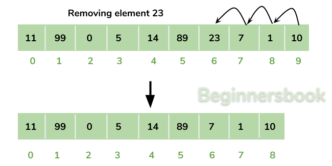
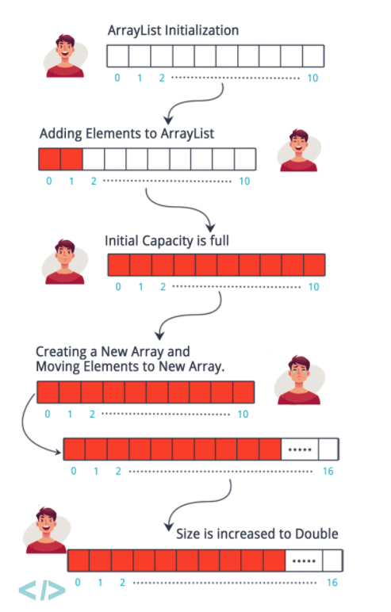
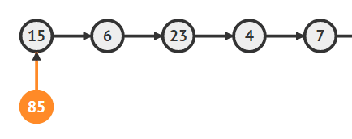
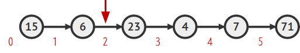
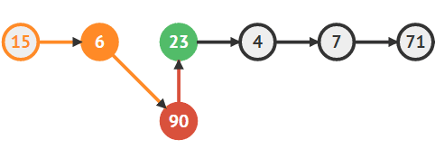
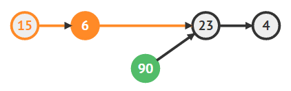

# Array and LinkedList

> Array

> Array vs List

> LinkedList

## Array

순차적으로 데이터를 저장하는 자료 구조

- 주로 서로 연결된 데이터들을 순차적으로 저장할 때 사용
- 삽입 순서대로 저장 (새로 삽입되는 요소는 배열의 맨 끝에 위치)
- 이미 생성된 것도 수정 가능(mutable)
- 동일한 값 여러번 삽입 가능
- 다중차원 배열(Multi-dimentional Array): 배열 안에 배열이 들어올 수 있음
- **고정된 크기**를 갖는 **같은 자료형**의 원소들이 **연속적인** 형태로 구성된 자료구조

> `순차적 자료구조(Sequential Data Structure)`: 데이터들이 순차적으로 메모리에 저장되어 있는 구조

## Array 특징


1. `인덱스(index)`로 해당 원소에 접근할 수 있다.
2. 추가적으로 소모되는 메모리 양(overhead)이 거의 없다.
3. `Cache hit rate`가 높다.
4. 배열을 생성하려면 메모리 상에 연속한 구간을 할당해야해서 할당에 제약이 걸릴 수 있다.

## Array 연산들과 시간 복잡도

- 임의의 위치에 있는 원소를 확인하거나 변경하는 연산: `O(1)`
- 배열의 가장 끝에 원소 추가: `O(1)`
- 배열의 가장 끝 원소 삭제: `O(1)`
- 임의의 위치에 원소를 추가하기 : `O(n)`
- 임의의 위치에 있는 원소 제거: `O(n)`

## Array 장점

- 랜덤 액세스가 빠르다.
- `index`를 통해 원소에 `O(1)` 시간복잡도만에 빠르게 접근할 수 있다.

## Array 단점



- Array의 중간 요소를 삭제한 경우, 뒤에 있는 데이터를 삭제한 요소 수 만큼 `shift`해줘야 하는 비용이 발생하고 이 경우의 시간 복잡도는 `O(n)`이 된다. (삽입의 경우도 마찬가지)
- 연속된 메모리 상에 원소들이 존재하므로 처음 배열을 선언한 크기만큼 데이터를 저장하지 않는다면 메모리 낭비가 발생한다.

### Dynamic Array 문제

- 데이터를 새로 추가할 때 `Resizing 문제`(메모리의 사이즈를 다시 조정하는 문제)가 생길 수 있다.

배열은 메모리를 순차적으로 채우며, 처음 생성될 때 어느 정도 메모리를 미리 할당(pre-allocation)한다.
메모리를 pre-allocation하면서 새로 추가되는 요소들도 순차적으로 메모리에 저장될 수 있다.
하지만 처음 할당한 것보다 요소가 더 많아진다면 `resizing`이 필요하다.
Array 특성상, 추가적으로 할당된 메모리 또한 순차적으로 들어가야 하기 때문에 상대적으로 오래 걸린다.



- 기존의 배열은 그대로 두고
- 새로운 길이로 지정된 배열을 따로 할당 후
- 데이터의 복사를 진행하고
- 기존의 배열을 삭제

## Array을 사용하면 좋은 경우

- 순차적인 데이터를 저장할 때(ex. 대회 결과)
- 다차원 데이터를 다룰 때 (ex. 배열 안의 배열이 필요한 경우)
- 데이터 사이즈가 자주 바뀌지 않을 때
- 요소가 자주 삭제되거나 추가되지 않을 때
- 배열에 저장된 데이터를 검색하는 작업이 많을 때

## 배열(Array) vs 리스트(List)

### 리스트(list)

**순서가 있는 데이터의 모임**이다. 다른 말로는 시퀀스(sequence)라고도 부른다.

- 순차성을 보장하지 못하기 때문에 `spacial locality` 보장이 되지 않아 `cache hit`가 어렵다.
- 리스트에서 인덱스는 몇 번째 데이터인가 정도의 의미를 가진다. (배열에서의 인덱스는 값에 대한 유일무이한 식별자)

> spacial locality: 프로그램 실행 시 접근하는 메모리 영역은 이미 접근이 이루어진 영역의 근처일 확률이 높다는 프로그램 성격 표현

### 언어별 list 지원

- 최근 언어들은 리스트를 기본으로 제공

**C**

- 리스트를 지원하지 않는다. 대신 배열을 지원한다.
- 리스트를 사용하려면 직접 만들거나 라이브러리를 사용해야 한다.

**JavaScript**

- 배열에 리스트의 기능이 포함되어 있다.

**Python**

- 기본적으로 리스트를 제공하며, 배열은 제공하지않는다.
- 파이썬에서는 리스트가 배열이다.
- 파이썬의 리스트는 크기가 가변적이고, 어떤 원소 타입이던 저장할 수 있다는 장점을 가진다. 대신 C의 배열보다 메모리를 더 많이 필요로 한다는 단점이 있다.

**Java**

- 배열과 리스트를 모두 지원하고, 두 가지가 완전히 분리되어 있다.
- 개발자가 원하는 대로 배열과 리스트 중 선택할 수 있다.
- 크게 2가지 형태의 리스트를 지원한다.
  - `LinkedList`
  - `ArrayList`

## Java - ArrayList/LinkedList

- 인덱스를 이용해서 데이터를 가져오는 것이 빈번하다면 내부적으로 배열을 이용하는 `ArrayList`가 더 빠르다.
- 데이터의 추가/삭제가 빈번하다면 `LinkedList`가 더 효과적이다.

### ArrayList

- 배열을 이용해서 리스트를 구현한 것을 의미한다.
- 장점: 내부적으로 배열을 사용하기 때문에 인덱스를 이용해서 접근하는 것이 빠르다.
- 단점: 데이터의 추가와 삭제가 느리다.

## LinkedList

배열은 미리 특정한 연결된 공간을 확보하고 데이터를 쓰고 있는 자료구조이고, 링크드 리스트는 필요할 때 마다 데이터를 추가할 수 있는 구조이다.
배열의 단점을 극복한 자료구조가 `링크드 리스트`라고 볼 수 있다.

## LinkedList 구조


### 노드

연결리스트 '노드'라는 객체로 이루어져 있다.

- Data를 저장할 공간
- 다음 노드의 주소를 가리킬 공간

```c
struct LinkedList {
    int data;
    struct LinkedList *next;
}
```


- 각 노드는 연속된 공간에 저장되어 있지 않고 메모리의 여러 부분에 분포되어 있다.
- 각 노드에 다음 노드의 주소를 저장함으로써 다음 노드를 탐색할 수 있다.
- 노드가 가리키는 다음 주소가 NULL이면 이노드는 마지막 노드라고 할 수 있다.

## LinkedList 장점

- 동적으로 메모리 사용이 가능하다.
- 메모리를 효율적으로 사용할 수 있다.
- 데이터 재구성이 용이하다.
- 대용량 데이터 처리에 적합하다.

## LinkedList 단점

- 특정 위치 데이터 검색할때 느리다.
- 메모리를 추가적으로 사용해야한다.

## 데이터 추가
### 시작부분에 추가


1. 새로운 노드를 생성한다.
`Vertex temp = new Vertex(input)`
2. 새로운 노드의 다음 노드로 첫번째 노드를 가리킨다.
`temp.next = head`
3. 새로 만들어진 노드가 첫번째 노드가 되도록 head의 값을 변경한다.
`head = temp`

### 중간에 추가
- 3번째 자리(인덱스 2)에 90을 추가하기



1. 우선 3번째 자리를 찾아야 한다.
2. head를 참조해서 첫번째 노드를 찾는다.
`Vertext temp1 = head`
3. 23자리에 새로운 노드를 위치시키기위해서는 6을 알고있어야한다. 6을 temp1으로 지정하기 위한 반복문이다.
```js
//현재 k의 값은 2
while (--k != 0)
  temp1 = temp1.next
```
4. 6의 next를 이용해서 23을 찾아서 temp2로 지정한다.
`Vertext temp2 = temp1.next`
5. 값이 90인 새로운 노드를 생성한다.
`Vertext newVertex = new Vertex(input)`
6. 6의 다음 노드로 새로운 노드를 지정한다.
`temp1.next = newVertex`
7. 새로운 노드의 다음 노드로 23번을 지정한다.
`newVertex.next = temp2`

## 데이터 삭제
- 세번째 노드(인덱스 2)를 제거하기




1. head를 이용해서 첫번째 노드를 찾는다.
`Vertex cur = head`
2. 두번째 노드로 이동한다.
```js
//k = 2
while(--k!=0)
  cur = cur.next
```
3. 세번째 노드 찾는다.
`Vertex tobedeleted = cur.next`
4. 두번째 노드의 next를 23으로 변경한다. 
`cur.next = cur.next.next`
5. 90을 삭제해서 메모리에서 제거한다.
`delete tobedeleted`

## LinkedList 연산들과 시간 복잡도

- 데이터 탐색: 순차 접근 방식을 사용하기 때문에 어떤 한 데이터를 찾기 위해서는 처음부터 순차적으로 탐색해야 한다.: `O(n)`
- 삽입/삭제: `O(1)`
- 원하는 노드에 접근 + 삽입/삭제: `O(n+1)`
- 가장 앞에 접근 + 삽입/삭제: `O(1)`
- 가장 뒤에 접근 + 삽입: `O(1+1)`(tail 노드 따로 지정한 경우)
- 뒤에서 두번째 노드(tail 노드 전 노드)접근 + 삭제: `O(n+1)`

---

## 참고

[Array](https://blog.encrypted.gg/927?category=773649)
[Array](https://kim-mj.tistory.com/236)
[ArrayVSList](https://wayhome25.github.io/cs/2017/04/17/cs-18-1/)
[LinkedList](https://opentutorials.org/module/1335/8821)
[LinkedList](https://sycho-lego.tistory.com/17)
[LinkedList](https://opentutorials.org/module/1335/8821)

## Q&A

---

<details>
<summary>Array와 LinkedList의 차이점을 설명하세요</summary>
Array는 Random Access를 지원한다. 요소들을 인덱스를 통해 직접 접근할 수 있다. 따라서 특정 요소에 접근하는 시간 복잡도는 O(1)이다. 반면 Linkedlist는 Sequential Access를 지원한다. 어떤 요소를 접근할 때 순차적으로 검색하며 찾아야 한다. 따라서 특정 요소에 접근할 때 시간 복잡도는 O(N)이다.

저장 방식도 배열에서 요소들은 인접한 메모리 위치에 연이어 저장된다.

반면 Linkedlist에서는 새로운 요소에 할당된 메모리 위치 주소가 linkedlist의 이전 요소에 저장된다.

배열에서 삽입과 삭제는 O(N)이 소요되지만, Linkedlist에서 삽입과 삭제는 O(1)이 소요된다.

배열에서 메모리는 선언 시 컴파일 타임에 할당이 된다. (정적 메모리 할당)

반면 Linkedlist에서는 새로운 요소가 추가될 때 런타임에 메모리를 할당한다. (동적 메모리 할당)

배열은 Stack 섹션에 메모리 할당이 이루어진다. 반면 Linkedlist는 Heap 섹션에 메모리 할당이 이루어진다.

</details>

<details>
<summary>Array(List)의 가장 큰 특징과 그로 인해 발생하는 장점과 단점에 대해 설명하세요. </summary>
Array의 가장 큰 특징은 순차적으로 데이터를 저장한다는 점입니다.

이렇게 데이터에 순서가 있기 때문에 0부터 시작하는 index가 존재하며, index를 사용해 특정 요소를 찾고 조작이 가능하다는 것이 Array의 장점입니다.

반면에 이에 따른 단점도 존재하는데, 순차적으로 존재하는 데이터의 중간에 요소가 삽입되거나 삭제되는 경우 그 뒤의 모든 요소들을 한 칸씩 뒤로 밀거나 당겨줘야 하는 단점이 있습니다.

이러한 경우 메모리 상에서 이루어지는 작업이 다른 자료구조에 비해 커지기 때문에 Array는 정보가 자주 삭제되거나 추가되는 데이터를 담기에는 적절치 않습니다.
</details>

<details>
<summary>Array를 적용시키면 좋을 데이터의 예를 구체적으로 들어주세요. (ex. 주식 차트) 구체적 예시와 함께 Array를 적용하면 좋은 이유, 그리고 Array를 사용하지 않으면 어떻게 되는지 함께 서술해주세요. </summary>
Array를 적용시키면 좋은 예로 주식 차트가 있습니다.

주식 차트에 대한 데이터는 요소가 중간에 새롭게 추가되거나 삭제되는 정보가 아니며, 날짜별로 주식 가격이 차례대로 저장되어야 하는 데이터입니다.

즉, 순서가 굉장히 중요한 데이터 이므로 Array 같이 순서를 보존해주는 자료구조를 사용하는 것이 좋습니다.

이와 같은 데이터에 Array를 사용하지 않는 경우, 즉 순서가 없는 자료 구조를 사용하는 경우에는 날짜별 주식 가격을 확인하기 어려우며 매번 전체 자료를 읽어 들이고 비교해야 하는 번거로움이 발생합니다.
</details>