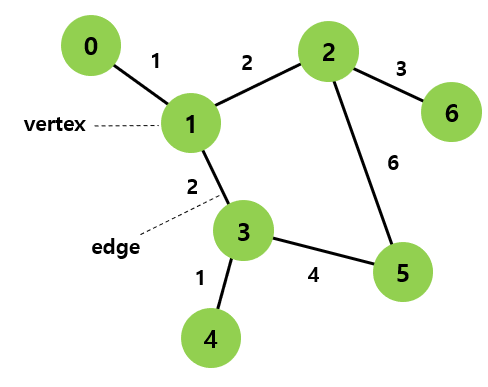
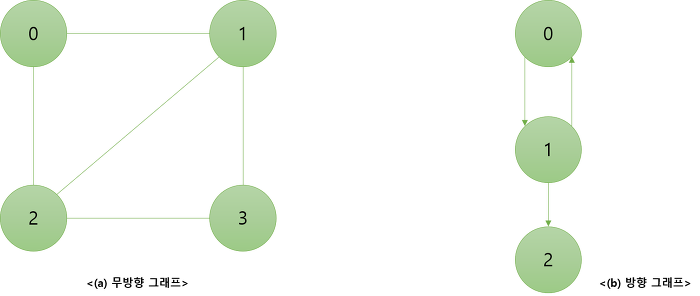
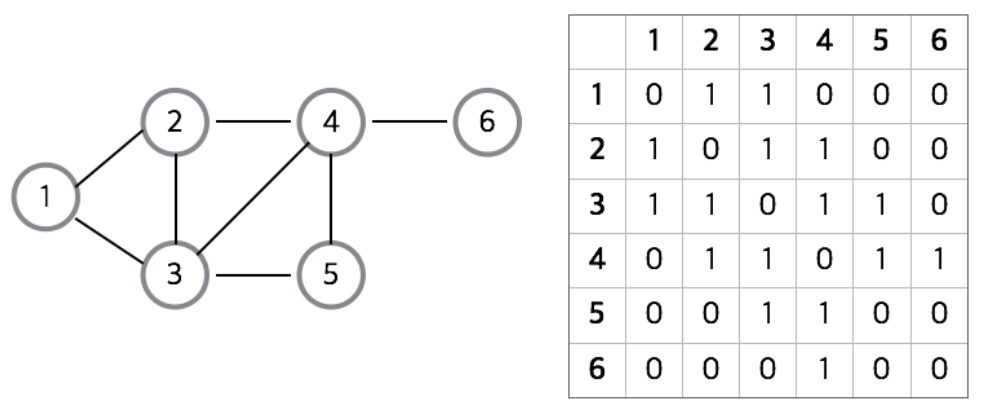
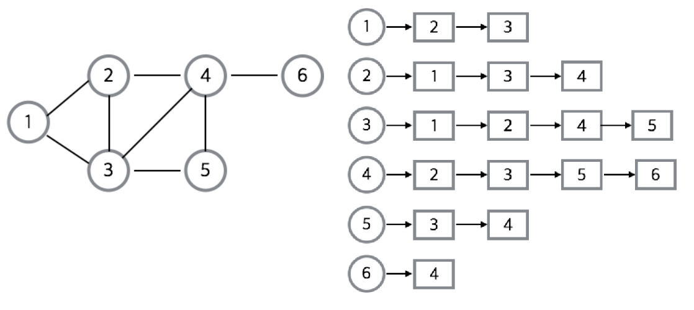
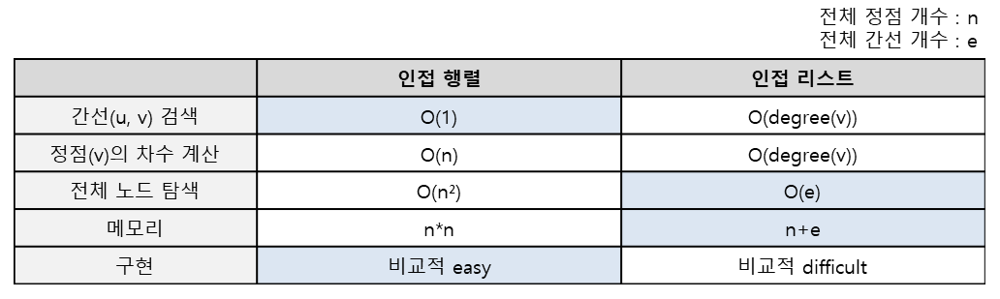
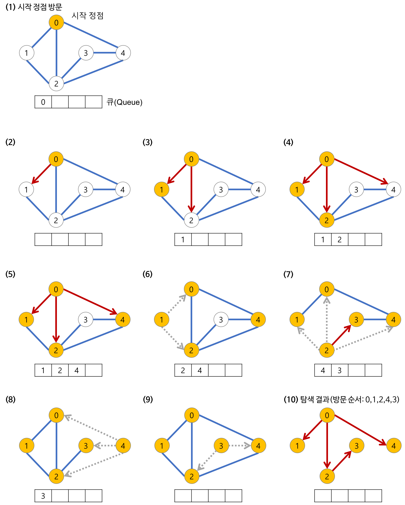

# Graph

> Graph 용어 정리

> Graph 종류

> Graph 구현

> Graph 탐색

 

## Graph(그래프)
객체 간의 관계를 표현할 수 있는 자료구조 

ex) 지도, 지하철 노선도의 최단 경로 등

- 정점(vertex; node)와 그 정점을 연결하는 간선(edge; arc)을 하나로 모아 놓은 자료구조

    

- 트리도 그래프의 특수한 형태

 

## 그래프 관련 용어 정리

- 인접 정점(adjacent vertex): 간선에 의해 직접 연결된 정점

- 부속(incident): 두 간선이 같은 정점을 공유하고 있다면 두 간선은 incident하다고 할 수 있다.

- 부분 그래프(subgraph)

- 정점의 차수(degree): 정점에 인접한 정점의 수
    - 무방향 그래프에서 하나의 간선은 두 개의 정점에 인접하기 때문에 간선 수에 2배를 해주면 된다.

    - 방향 그래프의 경우 외부에서 오는 간선의 수를 __진입 차수(in-degree)__ 라고 하며, 외부로 향하는 간선의 수를 __진출 차수(out-degree)__ 라고 한다.

- 루프(loop): 두 정점이 같은 정점인 간선(정점을 자체에 연결하는 간선)

- 경로(path): 간선을 따라갈 수 있는 길을 말하며, 정점을 나열하여 표시한다.
    - 경로의 길이(length): 경로를 구성하는 데 사용된 간선의 수

- 단순 경로(simple path): 경로 중에서 반복되는 정점이 없는 경우

- 사이클(cycle): 단순 경로의 시작 정점과 종료 정점이 동일한 경우

- 연결(connected): 두 정점 사이에 경로가 존재할 때 두 정점은 연결되었다고 한다.
    - 강한 연결

    - 약한 연결

 

## 그래프의 종류

### 무방향 그래프 VS 방향 그래프

- 무방향 그래프(Undirected Graph)
    - 무방향 그래프의 간선은 간선을 통해서 양 방향으로 갈 수 있다.
    - 정점 A와 정점 B를 연결하는 간선은 (A,B)와 같이 정점의 쌍으로 표현한다.

- 방향 그래프(Directed Graph)
    - 간선에 방향성이 존재하는 그래프
    - A->B로만 갈 수 있는 간선은 <A,B>로 표시한다.

### 가중치 그래프

- 가중치 그래프(Weighted Graph)
    - 간선에 비용이나 가중치가 할당된 그래프

### 연결 그래프 VS 비연결 그래프

- 연결 그래프(Connected Graph)
    - 무방향 그래프에 있는 모든 정점쌍에 대해서 항상 경로가 존재하는 경우

- 비연결 그래프(Disconnected Graph)
    - 무방향 그래프에서 특정 정점쌍 사이에 경로가 존재하지 않는 경우

### 사이클 VS 비순환 그래프

- 사이클(Cycle)
    - 단순 경로(Simple path)의 시작 정점과 종료 정점이 동일한 경우

- 순환(cycle)을 가지고 있으면 순환 그래프이고 그렇지 않으면 비순환 그래프

### 완전 그래프

- 완전 그래프(Complete Graph)
    - 그래프에 속해 있는 모든 정점이 서로 연결되어 있는 그래프
    - 무방향 완전 그래프
        - 정점 수가 n개이면 간선의 수는 n*(n-1)/2
    - 방향 완전 그래프
        - 정점 수가 n개이면 간선의 수는 n*(n-1)

 

## 그래프의 구현
- 그래프를 구현하는 방법에는 인접행렬(Adjacency Matrix)와 인접리스트(Adjacency List) 방식이 있다.

 

### 1. 인접행렬(Adjacency Matrix)
2차원 배열로 그래프의 연결 관계를 표현하는 방식

각 정점을 연결하는 정점에 다른 정점들이 인접 정점이라면 1, 아니면 0을 넣어준다.

만약 간선에 가중치가 있는 그래프라면 1 대신에 가중치의 값을 직접 넣어주는 방식으로 구현

__장점__

1. 2차원 배열 안에 모든 정점들의 간선 정보를 담기 때문에 배열의 위치를 확인하면 두 점에 대한 연결 정보를 조회할 때 O(1)의 시간복잡도면 가능

2. 직관적이며 쉽게 구현 가능

__단점__

1. 모든 정점에 대해 간선 정보를 대입해야 하므로 정점의 개수가 n개인 그래프는 간선의 수와 무관하게 항상 n^2의 메모리 공간이 필요하다.

2. 인접한 노드를 찾기 위해서는 모든 노드를 전부 순회해야 한다.

 

### 2. 인접리스트(Adjacency List)
리스트로 그래프의 연결 관계를 표현하는 방식

각각의 정점에 인접한 정점들을 리스트로 표시한 것이다.

__장점__

1. 정점들의 연결 정보를 탐색할 때 O(n)의 시간이면 가능 (n: 간선의 개수)

2. 필요한 만큼의 공간만 사용하기 떄문에 공간의 낭비가 적다.

__단점__

1. 특정 두 점이 연결되었는지 확인하려면 인접행렬에 비해 시간이 오래 걸린다. (배열보다 search 속도가 느림)

2. 인접행렬에 비해 구현이 비교적 어렵다.

 

## 그래프의 탐색
첫 정점에서부터 그래프에 존재하는 모든 정점들을 모두 한번씩 방문하는 것

그래프 탐색의 방법은 __깊이 우선 탐색(DFS)__ 과 __너비 우선 탐색(BFS)__ 방식이 있다.

두 방식 모두 조건 내의 모든 노드를 검색한다는 점에서 시간 복잡도는 동일

- 인접 리스트 : O(V+E)
- 인접 행렬 : O(V²)

 

### 1. 깊이 우선 탐색(DFS)
탐색 노드의 인접 노드의 자식 노드들을 모두 탐색하고, 다시 돌아가서 탐색 노드의 다른 인접 노드 자식들을 모두 탐색하는 방법

왼쪽을 먼저 탐색하냐, 오른쪽을 먼저 탐색하냐 같은 순서는 중요하지 않다.

스택 또는 재귀함수로 구현

 

### 2. 너비 우선 탐색(BFS)
탐색 노드의 인접한 노드를 먼저 탐색하는 방법

주로 두 노드 사이의 최단 경로를 찾고 싶을 때 이 방법을 선택

큐를 이용해서 구현

 

### 📚 참고
[Graph 1](https://gmlwjd9405.github.io/2018/08/13/data-structure-graph.html)

[Graph 2](https://yoongrammer.tistory.com/83)

[Graph 3](https://velog.io/@sso0022/swift-%ED%8A%B8%EB%A6%AC-%EA%B7%B8%EB%9E%98%ED%94%84)

[DFS & BFS](https://velog.io/@sukong/%EC%95%8C%EA%B3%A0%EB%A6%AC%EC%A6%98-%EA%B0%9C%EB%85%90-%EA%B9%8A%EC%9D%B4%EC%9A%B0%EC%84%A0%ED%83%90%EC%83%89DFS) 

 

***

 

# ⁉️ QnA

트리와 그래프의 차이점에 대해서 설명하시오

       

