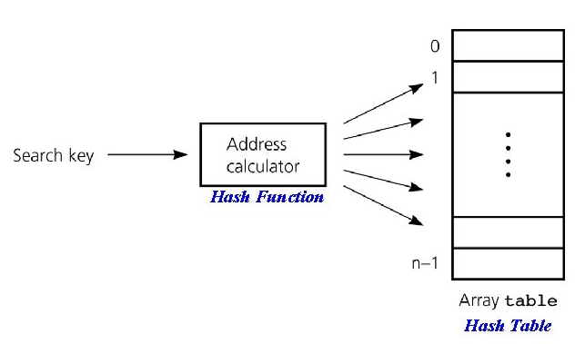

# 목차

> Hash Table  
> Hash Function  
> Hash Collision  
> Dynamic Resizing  
> Java의 HashTable과 HashMap
> 

# Hash Table

`key`에 대한 `hash` 값을 인덱스로 사용하여 `key-value`쌍의 데이터를 저장하고 조회하며, key-value쌍의 데이터의 개수에 따라 동적으로 크기가 증가하는 자료구조이다.

> `bucket`과 `hash function`

hash table은 array로 이루어져있고 array 각각의 주소를 `bucket` 이라 부른다. `hash function` 은 key-value의 key값을 array의 index로 매핑시키는 함수이다.



# Hash Function

hash function은 hash table이라고 불리는 array에 저장될 데이터의 위치(index)를 구하는 함수이다. 

- index를 구할 때, 보통 `mod` 연산을 사용한다.
- hash function을 통해 index를 구하는 과정을 `hashing` 이라고 한다.

> 완전 해시 함수

모든 key들이 서로 다른 hash값을 가지고 있어서 해시 충돌이 일어나지 않는 hash function이다. key의 전체집합을 미리 알고 있는 경우에 완전 해시 함수를 만들 수 있다.

> 객체가 나타내는 값의 종류 ≤ `2^32`

Boolean, Number(Integer, Long, Double) 처럼 객체가 나타내는 값의 개수(key의 전체집합)가 적다면 해당 객체를 완전 해시 함수의 대상으로 삼을 수 있다.

> 객체가 나타내는 값의 종류 > `2^32`

String, POJO와 같이 객체가 나타내는 값의 개수(key의 전체집합)가 int로 표현할 수 있는 개수(`2^32`)보다 많다면 해당 객체를 ***완전 해시 함수의 대상으로 삼을 수 없다***.( `hashCode()` 메소드의 반환값이 int 형이기 때문이다.)

> Java의 HashMap에서 완전 해시 함수를 사용할 수 없다

HashMap이 담을 수 있는 객체가 나타내는 값의 개수는 int 의 표현범위에 벗어나기 때문이다. 만약 int 표현범위를 벗어나지 않더라도 랜덤 접근시 시간복잡도 O(1)을 보장하기 위해서 `2^32` 길이의 배열을 가지고 있어야 한다. 이는 메모리 낭비를 야기한다.

# Hash Collision

> `hash bucket` 인덱스

```java
int m = hashTableSize; // m : 해시 테이블의 크기
int hash = object.hashCode(); // object: 자바 객체, hashCode() : 자바 객체의 hash function 
int index = hash % m; // hash bucket 인덱스
```
<details><summary>hashCode 메소드</summary>
<p>


```java
/**
* Returns a hash code value for the object. This method is
* supported for the benefit of hash tables such as those provided by
* {@link java.util.HashMap}.
* @return  a hash code value for this object.
* @see     java.lang.Object#equals(java.lang.Object)
* @see     java.lang.System#identityHashCode
*/
@HotSpotIntrinsicCandidate
public native int hashCode();

/**
* Returns the same hash code for the given object as
* would be returned by the default method hashCode(),
* whether or not the given object's class overrides
* hashCode().
* The hash code for the null reference is zero.
*
* @param x object for which the hashCode is to be calculated
* @return  the hashCode
* @since   1.1
* @see Object#hashCode
* @see java.util.Objects#hashCode(Object)
*/
@HotSpotIntrinsicCandidate
public static native int identityHashCode(Object x);
```
- 자바 객체의 `hashCode()` 메소드는 int형의 해시값을 반환한다. 기본적으로 `System.identityHashCode` 반환값을 반환하며, 사용자가 재정의할 수 있다.

</p>
</details>
  


<br/>

> `1/m` 확률의 `해시 충돌`

hash function의 표현범위를 m으로 좁힘으로써 서로 다른 hashCode값을 가진 객체가 `1/m` 의 확률로 동일한 해시 버킷 인덱스를 가질 수 있는 `해시 충돌`(hash collision) 이 발생한다. 해시 충돌은 hash function을 아무리 잘 구현하여도 상관없이 발생한다.


> `해시 충돌` 해결방법

해시 충돌이 발생해도 `Open Addressing`, `Seperate Chaining` 방식을 통해 key-value 구조의 데이터를 저장, 조회할 수 있다. 

## #️⃣Open Addressing (개방 주소법)

데이터를 삽입하려는 hash bucket이 이미 사용중이라면 비어있는 bucket을 찾아 데이터를 삽입하는 방식이다.

- Worst Case의 경우 비어있는 bucket을 찾지 못하고 탐색을 시작한 위치로 되돌아올 수 있다.
    - 데이터가 존재하는 bucket이 모여있으면 Worse Case 발생 빈도가 높아진다.
- 비어있는 bucket을 탐색하는 방식에는 `Linear Probing`, `Quadratic Probing`, `Double Hashing Probing` 이 있다.

### 1. Linear Probing (선형 탐색)

해시 충돌이 발생한 현재 bucket index부터 고정폭 `n` 만큼 이동하면서 비어있는 bucket을 찾아 데이터를 저장하는 방식이다.

- `hi(x) = (Hash(x) + i) % arraySize`
    - h(k) → h(k)+n → h(k)+2n → h(k)+3n ...

> Linear Probing 의사코드

```java
while(Node != null){  // 탐색 노드가 비어있다면 searchKey가 아직 저장이 안된 것

  if(Node.key == searchKey) return Node.value;  
  
  Node = Node.next;   // 규칙에 맞는 다음 노드
}
```

> Linear Probing 예시


> Linear Probing 단점 : `Primary Clustering` 문제

데이터가 존재하는 filled bucket들이 모여있다면 비어있는 bucket을 찾기 까지의 탐색 시간이 늘어난다. Primary Cluster가 형성되면 빠르게 커지고 결국 성능 저하를 야기한다.


### 2. Quadratic Probing (제곱 탐색)

해시 충돌이 발생한 현재 bucket index부터 `n^2` 만큼 이동하면서 비어있는 bucket을 찾아 데이터를 저장하는 방식으로 Linear Probing 방식의 Primary Clustering 발생 가능성을 줄일 수 있다.

- `hi(x) = (Hash(x) + i^2) % arraySize`
    - h(k) → h(k)+1^2 → h(k)+2^2 → h(k)+3^2 ...

> Quadratic Probing 예시


> Quadratic Probing 단점 : `Secondary Clustering` 문제

`n^2` 간격으로 filled bucket이 존재하여 key의 hash값(index) 보다 훨씬 떨어진 곳에 데이터가 삽입되는 현상이다. 이는 filled bucket 군집을 크게만들지 않기 때문에 Primary Clustering 보다 덜 심각한 문제이다.


### 3. Double Hashing Probing (이중 해싱 탐색)

hash값을 다른 hash function으로 한번 더 해싱하여 hash의 규칙성을 없애는 방식으로 Secondary Clustering 발생 가능성을 줄일 수 있다.

- `hi(x) = (Hash(x) + i * Hash2(X)) % arraySize`

> Double Hashing Probing 예시


### Open Addressing의 데이터 탐색 및 삭제

> 데이터 탐색(search) 알고리즘

target 데이터를 찾거나 empty bucket에 도달하기 전까지 탐색(probing)을 진행한다. target 데이터를 찾는 과정에서 empty bucket에 도달하면 탐색(probing)을 종료하는 문제점이 있다.

> 데이터 삭제의 문제점


`34` 를 insert하고 `35` 를 delete한 뒤 `34` 를 search하는 상황을 가정해보자.

`12` 부터 내려가면서 탐색을 진행하다가 empty bucket(5번)을 만나면 탐색을 종료하게 되어 `34` 까지 검색이 진행되지 않는다. 이는 Open Addressing 탐색 알고리즘(empty bucket을 만나면 probing 종료)으로 인한 문제이다. 

> 데이터 삭제의 문제 해결방법

삭제한 데이터의 bucket에 `dummy node` 를 넣거나 `flag` (Occupied, Empty, Deleted) 를 활용하여 탐색이 올바르게 진행되도록 할 수 있다. 

## #️⃣Seperate Chaining (분리 연결법)

각각의 hash bucket을 LinkedList를 가리키는 포인터로 구성하여 해시 충돌시 해당 bucket의 LinkedList에 추가하는 방식이다.

- 일반적으로 Seperate Chaining 방식은 Open Addressing 방식보다 빠르다.
    - Open Addressing은 데이터가 존재하는 bucket이 모여있으면 Worst Case 발생 빈도가 높아진다
    - Seperate Chaining은 해시 출돌을 피하도록 보조 해시 함수를 조정하면 Worse Case에 가까워지는 빈도를 줄일 수 있다.
- Java 7에서 HashMap은 Seperate Chaining 방식으로 구현되어있다.
- Seperate Chaining 방식은 보조 해시 함수를 사용하여 해시 충돌 가능성을 줄인다.


> `Red-Black Tree`로 구현한 Seperate Chaining

하나의 hash bucket에 해당하는 LinkedList의 데이터 개수가 `8개`가 되면 구조를 `LinkedList -> Red-Black Tree` 로 변환한다. LinkedList 탐색 성능의 Worst Case는 O(N) 이지만 Red-Black Tree의 경우 O(logN)이기 때문이다.

하나의 hash bucket에 할당된 데이터 개수가 `6개`이면 구조를 `Red-Black Tree -> LinkedList`로 변환한다. 데이터 개수가 적으면 Red-Black Tree와 LinkedList간의 탐색 성능 차이가 거의 없기 때문이다.

> 변환 기준이 `6개`, `8개` 인 이유

변환 기준을 `6개`, `8개` 처럼 2개라는 여유를 두어 과도한 구조 변환을 막을 수 있다. 만약 변환 기준이 `6개` , `7개` 이라면 데이터가 반복적으로 삽입, 삭제되는 경우 불필요한 LinkedList ↔ Tree 변환이 일어나 성능 저하가 발생할 수 있다.

> `LinkedList -> Red-Black Tree`로 변환가능한 이유

HashMap의 데이터 `Node` 는 `TreeNode` 의 부모 클래스이기 때문에 `replacementTreeNode` 메소드를 통해 `Node -> TreeNode` 로 변환할 수 있다.

```java
// replacementTreeNode : HashMap의 내부 함수
TreeNode<K,V> replacementTreeNode(Node<K,V> p, Node <K,V> next) {
    return new TreeNode<>(p.hash, p.key, p.value, next);
}

// 상속 관계 : TreeNode <- LinkedHashMap.Entry <- HashMap.Node
static final class TreeNode<K,V> extends LinkedHashMap.Entry<K,V> { 
		...
}
public class LinkedHashMap<K,V> extends HashMap<K,V> implements Map<K,V> {
		static class Entry<K,V> extends HashMap.Node<K,V> { ... }
}
```

## Open Addressing vs Separate Chaining

|  | Open Addressing | Seperate Chaining |
| :---: | --- | --- |
| Worst Case | O(M) | O(M) |
| 캐시 효율 | 좋다 (연속된 공간에 데이터를 저장하기 때문이다) | Open Addressing 보다 좋지 않다 (해시 충돌시 LinkedList에 데이터를 저장하기 때문이다) |
| 공간 효율 | 좋다 (해시 충돌이 발생한 경우에도 probing을 통해 빈 bucket에 저장되기 때문이다) | Open Addressing 보다 좋지 않다 (해시 충돌이 발생하면 LinkedList에 추가되기 때문에 사용되지 않는 bucket이 존재한다) |
| Resizing 빈도 | 높다 (bucket 사용률이 높아 load factor의 임계점에 쉽게 도달하기 때문이다) | Open Addressing 보다 낮다 (bucket 사용률이 낮기 때문이다) |

# Dynamic Resizing

hash bucket의 개수가 적다면 메모리 사용을 아낄 수 있지만 해시 충돌로 인해 성능 저하가 발생한다. 그러므로 HashMap은 `load factor`가 임계점(`0.75`)을 넘어갈 경우, hash bucket 개수를 2배로 늘린다.

> `load factor` (적재율)

```java
load factor (α) = n / k
	- n : 데이터가 저장된 bucket 수
	- k : 전체 bucket 수
```

load factor는 hash table에 데이터가 차있는 비율을 나타낸다. 

- load factor가 1에 가까우면 hash table의 성능이 저하되고, 너무 작은 값을 가지면 비효율적이다. 그러므로 hash table resizing을 통해 load factor 를 조절해야한다.
- `0.6 ≤ load factor ≤ 0.75` 가 바람직하다.

# Java의 HashTable과 HashMap

`HashTable`

- JDK 1.0부터 존재한 Java API이다.
- 현재까지 HashTable의 구현에 변화가 거의 없다. (하위 호환성을 제공하기 위해 남아있다)
- 보조 해시 함수를 사용하지 않는다.
- 다중 스레드 환경에서 Thread safe 하다
- key값에 null을 저장할 수 없다

`HashMap`

- Java 2에 선보인 Java Collections Framework API이다.
- 지속적으로 개선이 이뤄지고 있다.
- 보조 해시 함수를 사용하기 때문에 해시 충돌이 HashTable보다 덜 발생할 수 있다.
- 다중 스레드 환경에서 Thread safe 하지 않다
- key값에 null을 저장할 수 있다

## 참고

[wikipedia](https://en.wikipedia.org/wiki/Hash_table)

[Hash Table 원리와 구현](https://ecsimsw.tistory.com/entry/Hash-Table-%EC%9B%90%EB%A6%AC%EC%99%80-%EA%B5%AC%ED%98%84?category=887812)

[Hashtable의 이해와 구현 #1](https://bcho.tistory.com/1072)

[Java HashMap은 어떻게 동작하는가?](https://d2.naver.com/helloworld/831311)

[Open Addressing & its Classification to eliminate Collisions](https://www.codingeek.com/data-structure/complete-guide-open-addressing-classification-eliminate-collisions/)

[Hashing Initially prepared by Dr lyas iekli improved](https://slidetodoc.com/hashing-initially-prepared-by-dr-lyas-iekli-improved/)

[What is primary and secondary clustering in hash?](https://stackoverflow.com/questions/27742285/what-is-primary-and-secondary-clustering-in-hash)

[Secondary Clustering](https://slideplayer.com/slide/12974233/)

[HashMap 파헤치기 1 (Linked List + Red Black Tree)](https://lordofkangs.tistory.com/78)

[Open Addressing vs Seperate Chaining](https://www.geeksforgeeks.org/hashing-set-3-open-addressing/)
