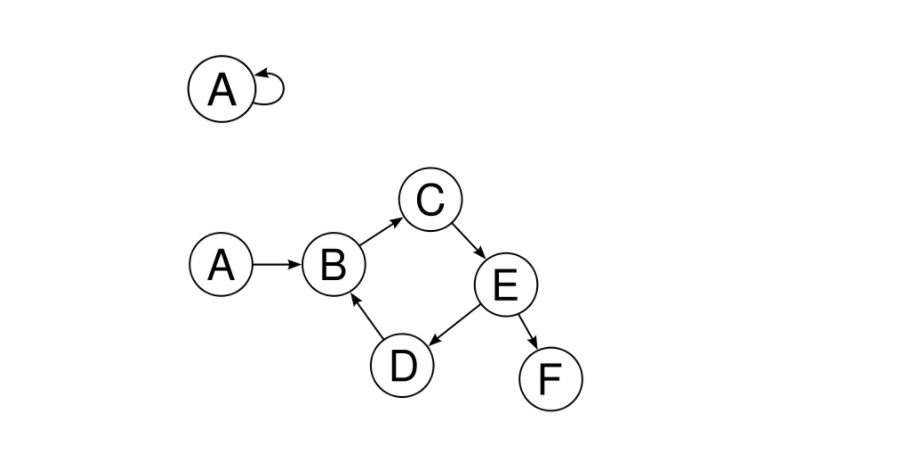
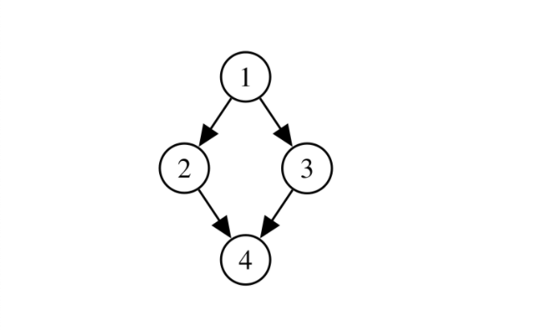
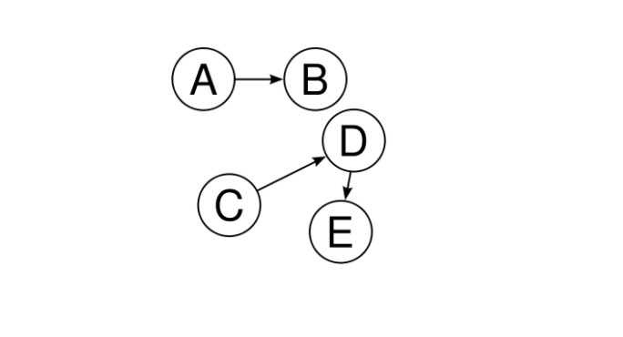
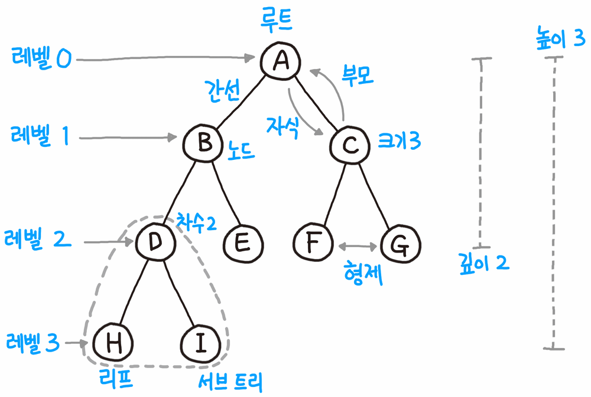
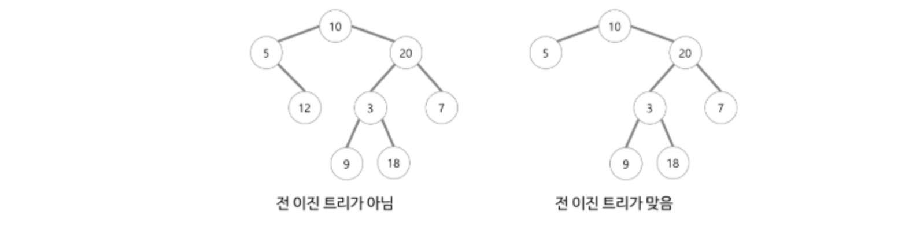
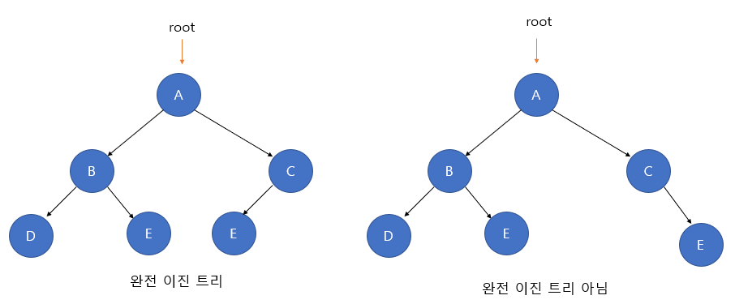
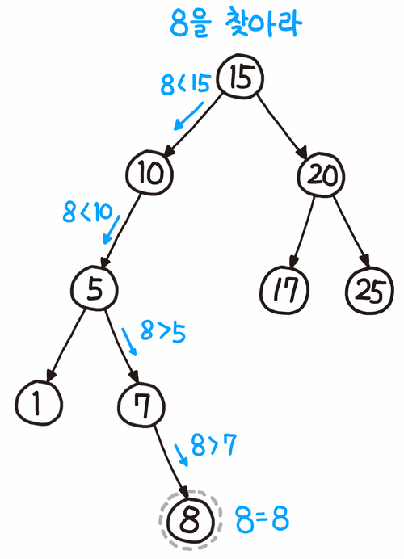

## 🌳 Tree트리
> Tree의 구조, 정의 및 용어

> Binary Tree

> Binary Tree의 특징

### Tree란?
트리는 노드로 이루어진 비선형적 구조이다.
트리가 되기위해서는 

1. 임의의 노드에서 다른 노드로 가는 경로는 유일하다.
2. __사이클(회로)가 존재하지 않는다.__
3. 모든 노드는 서로 연결되어 있다.
4. __edge:간선을 하나 자르면 트리가 두개로 분리된다.__
5. 간선의 수|E|는 |V|에서 1을 뺀 것과 같다.

### 트리가 아닌 경우


> 👆 사이클이 존재함.



> 👆 사이클 존재하지 않지만 1에서 4로 가는 경로 유일하지 않음



> 👆 연결되지 않은 노드가 존재.

### Terms


#### 노드
- 루트 노드 :부모가 없는 노드, 트리는 하나의 루트노드 만을 가진다.
- 단말 노드 :자식이 없는 노드. '말단 노드(terminal)', '잎 노드(leaf)'
- 내부 노드 :단말 노드가 아닌 노드
- 부모 노드 : 루트 노드 방향으로 직접 연결된 노드
- 형제 노드:같은 부모를 가지는 노드
- 자식 노드 :로트 노드 반대방향으로 직접 연결된 노드

- 간선 :노드를 연결하는 선


#### 노드 관련 
- 노드의 크기 :자신을 포함한 모든 자손 노드의 개수
- 깊이 :루트에서 어떤 노드에 도달하기 위해 거쳐야하는 간선의 수
- 레벨 :트리의 특정 깊이를 가지는 노드의 집합
- 차수 :각 노드가 지닌 자식의 수

#### 트리 관련
- 트리의 차수 :트리의 최대 차수 (max(deg1, deg2, deg3))
- 트리의 높이 :루트 노드에서 가장 깊숙히 있는 노드의 깊이
<br><br><br><br>
## 🌲🌲 Binary Tree
> 이진트리란 자식 노드가 최대 두 개의 노드들로 구성된 트리이다.
- 정 이진트리(full binary tree)
- 완전 이진트리(complete binary tree)
- 균형 이진트리(balanced binary tree)
<br>
<br>

### 전 이진 트리(full)

- 정 이진트리는 잎새노드를 제외한 모든 노드가 자식노드를 `2개 또는 0개` 가짐
- 정 이진트리에서 레벨에 따른 노드의 숫자는 아래 표와 같다.
<br>


|레벨|노드수|
|--|-----|
|0|2^0|
|1|2^1|
|3|2^2|
|3|2^3|
|k|2^k|

### 완전 이진 트리(complete)

- 완전 이진 트리는 `마지막 레벨을 제외한 모든 레벨에서 노드들이 꽉 채워진 이진트리`
- 데이터가 `왼쪽 단말 노드`부터 채워져야 한다.
- 완전 이진 트리는 1차원 배열로도 표현이 가능하다.

### 균형 이진 트리

- 모든 잎새 노드의 깊이 차이가 최대 1인 트리
- 균형 이진 트리는 예측 가능한 깊이를 가지며, 노드가 n개인 균형 이진 트리의 깊이는 log n을 내림한 값을 가진다.
- 힙 정렬과 이진 탐색 트리는 모두 이진 트리를 기반으로 만들어진 기법이다.

### 파이썬으로 구현한 트리
### 자료 구조
```python
class Node:
    def __init__(self, data):
        self.data = data
        self.left = None
        self.right = None
    def __str__(self):
        return str(self.data)
class Tree:
    def __init__(self):
        self.root = None
```

### 순회
> 자신을 기준으로 출력 순서를 생각하면 쉽다. 전위는 자신 먼저, 중위는 내가 중간 순서, 후위는 내가 마지막 순서임.

- 전위 순회


```python
def preorder(self, node):
    print(node, end = '')
    if not node.left == None : self.preorder(node.left)
    if not node.right == None : self.preorder(node.right)
```
<br>

- 중위 순회

```python
def inorder(self, node):
    if not node.left == None : self.preorder(node.left)
    print(node, end = '')
    if not node.right == None : self.preorder(node.right)
```
<br>

- 후위 순회

```python
def preorder(self, node):
    if not node.left == None : self.preorder(node.left)
    if not node.right == None : self.preorder(node.right)
    print(node, end = '')
```
- 이진 탐색 트리를 중위 순회를 하면 정렬된 결괄르 얻을 수 있다.

### 이진 탐색 트리(Binary Search Tree/BST)

<br>
- 이진 트리의 일종으로 노드 왼쪽은 자기 자신보다 작은 값만 가지고, 오른쪽은 자기 자신 보다 큰 값만을 가진다.
- 이렇게 구성하면 어떤 값 n을 찾을 때, 루트 노드와 비교해서 n이 더 작다면 오른쪽 트리를 탐색할 필요가 없다.
- 이상적인 상황에서 탐색/삽입/삭제 모두 시간 복잡도가 O(logn)이다.
`이상적인 상황 = 균형잡인 이진 트리`
<br>

### 이진 탐색 트리 찾는 과정

<br><br><br>
### 📚 참고


[트리의성질](https://namu.wiki/w/%ED%8A%B8%EB%A6%AC(%EA%B7%B8%EB%9E%98%ED%94%84))
<br>

[이진트리1](https://smujihoon.tistory.com/153)
<br>

[이진트리2](https://ratsgo.github.io/data%20structure&algorithm/2017/10/21/tree/)

***
# ⁉️ QnA
<details>
<summary>BST와 Binary Tree에 대해서 설명하시오</summary>
<div markdown="2">       

이진 탐색 트리는 이진 탐색과 연결리스트를 결합한 자료구조이다. 이진 탐색의 효율적인 탐색 능력과 함께 빈번한 자료 입력과 삭제가 가능하다. 이진 탐색 트리는 왼쪽 트리의 모든 값이 반드시 부모 노드보다 작아야 하고, 반대로 오른쪽은 트리의 모든 값이 부모 노드보다 커야하는 특징이 있다. 이진 탐색 트리의 이상적인 상황에서의 탐색, 삽입, 삭제의 시간복잡도는 O(logn)이다. 보통의 케이스에서 O(height)이 걸린다. 그래서 균형을 맞춰 주기 위해서 AVL Tree를 이용한다.

</div>
</details>