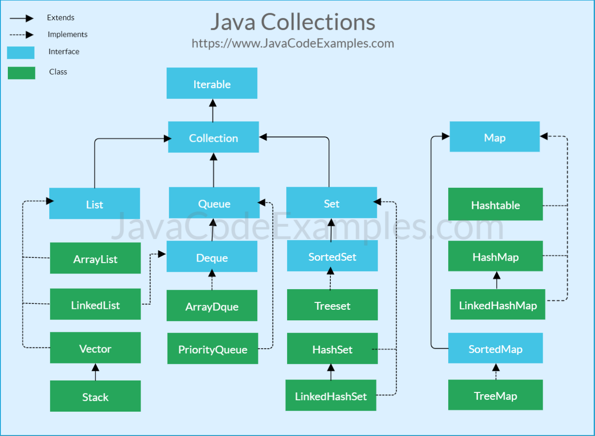

# Collection

> Collection    
List Interface    
Set Interface    
Map Interface
> 

<br/>

# *Collection*



Java의 Collection란 데이터의 집합, 그룹을 의미한다.

- `Java Collections Framework(JCF)`는 Collection과 이를 구현하기 위한 클래스를 정의하는 interface를 제공한다.
- Collection Interface는 크게 `List`, `Set`, `Queue` 3가지로 분류된다.
- `Map` 인터페이스는 Collection 인터페이스를 상속받지 않지만 Collection으로 분류한다.

<br/>

# *List Interface*

`List`란 순서가 있는 데이터의 집합이다.

- List Interface의 구현 클래스에는 `Vector`, `ArrayList`, `LinkedList`가 있다.
- List의 index에는 데이터의 주소값(참조값)이 들어있다.
    - 데이터 자체를 저장하지 않고 주소를 참조한다
    - `null` 이 저장될 경우 해당 index에는 참조값 조차 들어있지 않다.
- 데이터의 중복을 허용한다
    - List 속 중복된 데이터는 모두 동일한 주소값을 참조한다

<br/>

## 📌ArrayList

```java
List<String> list = new ArrayList<>(Arrays.asList(1, 2, 3));
```


`ArrayList`란 크기가 가변적으로 변하는 선형 리스트이다.

- `Object 배열` 에 데이터를 순차적으로 저장하고 index로 Object 배열 속 객체를 관리한다.
- `Capacity(저장 용량)` 을 초과하면 자동으로 저장 용량을 늘린다. (더 큰 크기의 배열을 생성하여 기존의 데이터를 새로운 배열에 복사)

<br/>

> ArrayList는 어떤 방식으로 저장 용량을 늘릴까?
> 

결론부터 말하면, **일반적인 상황에서 새로운 Object 배열을 기존 Object 배열의 1.5배 크기로 확장시킨다**


<details>
<summary>이유 설명</summary>

```java
/**
    * Default initial capacity.
    */
private static final int DEFAULT_CAPACITY = 10;

/**
    * Shared empty array instance used for empty instances.
    */
private static final Object[] EMPTY_ELEMENTDATA = {};

/**
    * Shared empty array instance used for default sized empty instances. We
    * distinguish this from EMPTY_ELEMENTDATA to know how much to inflate when
    * first element is added.
    */
private static final Object[] DEFAULTCAPACITY_EMPTY_ELEMENTDATA = {};

/**
    * The array buffer into which the elements of the ArrayList are stored.
    * The capacity of the ArrayList is the length of this array buffer. Any
    * empty ArrayList with elementData == DEFAULTCAPACITY_EMPTY_ELEMENTDATA
    * will be expanded to DEFAULT_CAPACITY when the first element is added.
    */
transient Object[] elementData; // non-private to simplify nested class access
```

ArrayList는 내부에서 Object 배열에 데이터를 저장한다

- ArrayList의 생성자를 통해 elementData 배열의 capacity를 직접 설정할 수 있다.
- 기본 생성자로 ArrayList를 생성하면 elementData에 `EMPTY_ELEMENTDATA` 라는 빈 Object 배열이 할당된다
- 참고) transient란 객체를 직렬화하는 과정에서 제외하고 싶은 변수에 선언하는 키워드이다.

```java
/**
    * This helper method split out from add(E) to keep method
    * bytecode size under 35 (the -XX:MaxInlineSize default value),
    * which helps when add(E) is called in a C1-compiled loop.
    */
private void add(E e, Object[] elementData, int s) {
    if (s == elementData.length)
        elementData = grow();
    elementData[s] = e;
    size = s + 1;
}

/**
    * Appends the specified element to the end of this list.
    *
    * @param e element to be appended to this list
    * @return {@code true} (as specified by {@link Collection#add})
    */
public boolean add(E e) {
    modCount++;
    add(e, elementData, size);
    return true;
}
```
`if (s == elementData.length)`
- ArrayList에 데이터를 추가하면 `s` (현재까지 저장된 데이터 개수)와 `elementData.length` (Object 배열의 할당된 길이)를 비교하여 Object 배열의 사이즈를 조정해야 할지 판단한다.
    - `elementData = grow();` 코드를 통해 Object 배열의 크기를 동적으로 늘어나게 해준다.

```java
/**
    * Increases the capacity to ensure that it can hold at least the
    * number of elements specified by the minimum capacity argument.
    *
    * @param minCapacity the desired minimum capacity
    * @throws OutOfMemoryError if minCapacity is less than zero
    */
private Object[] grow(int minCapacity) {
    return elementData = Arrays.copyOf(elementData,
                                        newCapacity(minCapacity));
}

private Object[] grow() {
    return grow(size + 1);
}
```

- `grow(int minCapacity)` 메소드는 기존의 elementData 배열에 `newCapacity(minCapacity))` 길이 만큼의 새로운 Object 배열을 초기화한다. (minCapacity는 현재 ArrayList 사이즈 + 1이다)

```java
/**
    * The maximum size of array to allocate (unless necessary).
    * Some VMs reserve some header words in an array.
    * Attempts to allocate larger arrays may result in
    * OutOfMemoryError: Requested array size exceeds VM limit
    */
private static final int MAX_ARRAY_SIZE = Integer.MAX_VALUE - 8; // 👉 2147483639

/**
    * Returns a capacity at least as large as the given minimum capacity.
    * Returns the current capacity increased by 50% if that suffices.
    * Will not return a capacity greater than MAX_ARRAY_SIZE unless
    * the given minimum capacity is greater than MAX_ARRAY_SIZE.
    *
    * @param minCapacity the desired minimum capacity
    * @throws OutOfMemoryError if minCapacity is less than zero
    */
private int newCapacity(int minCapacity) {
    // overflow-conscious code
    int oldCapacity = elementData.length;
    int newCapacity = oldCapacity + (oldCapacity >> 1); // 👉 기존 용량의 1.5배
    if (newCapacity - minCapacity <= 0) {
        if (elementData == DEFAULTCAPACITY_EMPTY_ELEMENTDATA)
            return Math.max(DEFAULT_CAPACITY, minCapacity);
        if (minCapacity < 0) // overflow
            throw new OutOfMemoryError();
        return minCapacity;
    }
    return (newCapacity - MAX_ARRAY_SIZE <= 0)
        ? newCapacity
        : hugeCapacity(minCapacity);
}
```

- `newCapacity(minCapacity)` 메소드는 새롭게 할당할 배열의 사이즈를 반환하는 메소드이다.
    - `할당된 Object 배열의 사이즈 x 1.5` (newCapacity)가 `현재 사이즈 + 1` (minCapacity) 보다 작거나 같을 때, elementData가 빈 Object 배열이라면 `DEFAULT_CAPACITY` (10) 을 반환한다.
    - `할당된 Object 배열의 사이즈 x 1.5` (newCapacity)가 `현재 사이즈 + 1` (minCapacity) 보다 크면, `할당된 Object 배열의 사이즈 x 1.5` (newCapacity) 을 반환한다. (최대 크기 MAX_ARRAY_SIZE는 `Integer.MAX_VALUE - 8` ==2147483639 이다)
- **일반적인 상황에서 새로운 Object 배열을 기존 Object 배열의 1.5배 크기로 확장시킨다**

```java
private static int hugeCapacity(int minCapacity) {
    if (minCapacity < 0) // overflow
        throw new OutOfMemoryError();
    return (minCapacity > MAX_ARRAY_SIZE)
        ? Integer.MAX_VALUE
        : MAX_ARRAY_SIZE;
}
```

- 만약 `newCapacity(minCapacity)` 메소드에서 `할당된 Object 배열의 사이즈 x 1.5` (newCapacity)가 MAX_ARRAY_SIZE를 넘어갈 경우 `hugeCapacity(minCapacity)` 메소드를 수행한다
    - `현재 사이즈 + 1` (minCapacity)가 MAX_ARRAY_SIZE보다 크다면, 새로운 배열의 사이즈를 `Integer.MAX_VALUE` (2147483647)로 설정한다.
    - `현재 사이즈 + 1` (minCapacity)가 int의 표현 범위를 넘어서면 OutOfMemoryError를 발생시킨다.

</details>


<br/>

> 배열과 ArrayList의 차이점
> 
- 배열은 생성할 때 크기가 고정되어 있고 사용중에 크기를 동적으로 변경할 수 없다.
- ArrayList는 저장 용량이 초과하면 자동으로 용량을 늘릴 수 있다.

<br/>

> ArrayList의 시간복잡도 ([참고](https://sabarada.tistory.com/63))
> 
- `조회`
    - index를 통해 `O(1)`의 시간복잡도로 조회할 수 있다
- `삽입/삭제`
    - 내부적으로 Object 배열로 구성되어있으므로 중간 또는 맨 앞에 데이터를 삽입, 삭제할 때 최악의 경우 `O(N)`의 시간복잡도를 가진다
    - 추가하려는 데이터의 위치가 맨 뒤이고, Object 배열에 가용 공간이 있다면 `O(1)`의 시간복잡도를 가진다

<br/>

## 📌Vector

```java
List<E> list = new Vector<>();
```

`Vector` 는 ArrayList와 동일한 기능을 수행하는 클래스이다.

- 내부에서 동기화 처리를 하기 때문에 ArrayList보다 상대적으로 성능이 좋지 않다
- 기존 코드와 호환성을 위해 남아있다

<br/>

> ArrayList와 Vector의 차이점
> 
- ArrayList는 자동으로 동기화 처리를 하지 않기 때문에 Thread Safe 하지 않다.
- Vector는 Thread의 수와 상관없이 동기화 처리를 하기 때문에 Thread Safe 하지만 싱글 스레드 환경에서 조차 동기화 처리를 하므로 ArrayList에 비해 성능이 좋지 않다

<br/>

## 📌LinkedList

```java
List<E> list = new LinkedList<>();

// LinkedList의 linkFirst 메소드
/**
 * Links e as first element.
 */
private void linkFirst(E e) {
    final Node<E> f = first;
    final Node<E> newNode = new Node<>(null, e, f);
    first = newNode;
    if (f == null)
        last = newNode;
    else
        f.prev = newNode;
    size++;
    modCount++;
}

// LinkedList.class의 private class인 Node
private static class Node<E> {
        E item;
        Node<E> next;
        Node<E> prev;

        Node(Node<E> prev, E element, Node<E> next) {
            this.item = element;
            this.next = next;
            this.prev = prev;
        }
    }
```

`LinkedList` 는 데이터를 Node로 감싸고, Node를 통해 양방향 포인터 구조로 데이터를 관리한다

- Stack, Queue, Deque를 만들기 위한 용도로 사용된다.
- 데이터 삽입, 삭제가 빈번할 경우 데이터의 포인터 정보만 수정하면 되므로 유용하다

<br/>

> LinkedList의 시간복잡도 ([참고](https://sabarada.tistory.com/64?category=826240))
> 

```java
public class LinkedList<E>
    extends AbstractSequentialList<E>
    implements List<E>, Deque<E>, Cloneable, java.io.Serializable
{
    transient int size = 0;

    /**
     * Pointer to first node.
     */
    transient Node<E> first;

    /**
     * Pointer to last node.
     */
    transient Node<E> last;
```

- `조회`
    - first 포인터부터 타겟 데이터까지 순차적으로 탐색해야하기 때문에 최악의 경우 `O(N)` 의 시간복잡도를 가진다
- `삽입/삭제`
    - 나머지 데이터를 shift할 필요 없이 삽입/삭제할 데이터(노드)의 포인터만 수정하면 된다. (`O(1)`) 하지만 삽입/삭제 하려는 데이터의 위치가 중간에 있다면 탐색해야하기 때문에 최악의 경우 `O(N)` 의 시간복잡도를 가진다.

<br/>

> ArrayList와 LinkedList의 차이점 ([참고](https://girawhale.tistory.com/8))
> 

|  | ArrayList |  LinkedList |
| --- | --- | --- |
| 조회/수정 | O(1) index로 데이터에 접근할 수 있다. | O(N) 순서는 있지만, index가 없어 iterator를 사용하여 탐색해야한다. |
| add (시작) | O(N) | O(1) |
| add (중간) | O(N) | O(N) |
| add (끝) | O(1) | O(1) |
| remove (시작) | O(N) 해당 index의 +1 위치부터 끝까지 모두 1칸씩 앞으로 당겨야 한다. | O(1) 양방향 포인터 정보만 변경해준다. |
| remove (중간) | O(N) | O(N) |
| remove (끝) | O(1) | O(1) |

데이터의 탐색이 빈번하다면 `ArrayList` 이 바람직하고, 데이터의 추가, 삭제가 빈번하다면 `LinkedList` 이 바람직하다 ([[프로그래머스] 표 편집 문제](https://programmers.co.kr/learn/courses/30/lessons/81303))

<br/>

> 그렇다면 추가, 삭제, 조회가 빈번할 경우 무엇을 사용해야할까?
> 

|  | ArrayList | LinkedList |
| --- | --- | --- |
| add | 6 ms | 3 ms |
| get | 0.01 ms | 157 ms |
| remove | 135 ms | 126 ms |

**굳이 고르자면 `ArrayList`이다**. 조회의 경우 ArrayList가 LinkedList보다 매우 빠르지만, 삽입/삭제의 경우 ArrayList와 LinkedList의 속도 차이가 작기 때문이다.

<br/>

# *Set Interface*

`Set`이란 순서를 유지하지 않는 데이터의 집합이다.

- Set Interface의 구현 클래스로 `HashSet` , `TreeSet` 이 있다.
- Set은 index 개념이 없기 때문에 데이터를 탐색하려면 iterator를 사용해야 한다.
    - `Iterator<String> iter = set.iterator();`

<br/>

## 📌HashSet

```java
Set<E> set = new HashSet<>();

public class HashSet<E>
    extends AbstractSet<E>
    implements Set<E>, Cloneable, java.io.Serializable
private transient HashMap<E,Object> map;

// Dummy value to associate with an Object in the backing Map
private static final Object PRESENT = new Object();

// HashSet의 생성자
/**
* Constructs a new, empty set; the backing <tt>HashMap</tt> instance has
* default initial capacity (16) and load factor (0.75).
*/
public HashSet() {
    map = new HashMap<>();
}

// HashSet의 add 메소드
/**
* Adds the specified element to this set if it is not already present.
* More formally, adds the specified element <tt>e</tt> to this set if
* this set contains no element <tt>e2</tt> such that
* <tt>(e==null&nbsp;?&nbsp;e2==null&nbsp;:&nbsp;e.equals(e2))</tt>.
* If this set already contains the element, the call leaves the set
* unchanged and returns <tt>false</tt>.
*
* @param e element to be added to this set
* @return <tt>true</tt> if this set did not already contain the specified
* element
*/
public boolean add(E e) {
    return map.put(e, PRESENT)==null;
}
```

`HashSet`의 내부를 살펴보면 HashMap을 사용하고 있다.

- HashMap은 key-value 쌍의 데이터를 저장할 수 있는 Map Interface의 구현 클래스이다. HashSet에서는 HashMap의 key만 사용하고 value에는 dummy 값 `PRESENT` 를 채운다.
    
    즉 `Set<E> set = new HashSet<>();` 으로 HashSet 객체를 선언하면 key값으로 E객체가 채워져있고 value에는 dummy 객체가 채워진 HashMap이 생성된다.
    

<br/>

> HashSet의 특징
> 
- 데이터의 순서를 알 수 없다
- key값으로 타겟 데이터를 조회할 수 있다 → `O(1)`
- 동일한 데이터를 중복 저장할 수 없다.

<br/>

> HashSet에 중복 데이터를 저장할 수 없는 이유
> 

일단 HashSet은 내부적으로 HashMap을 사용한다. HashMap의 key는 객체의 해시값이다. 자바에서 객체의 해시값은 `hashCode()` 메소드로 구할 수 있다.

다만 hashCode() 메소드는 정수 값을 반환하기 때문에 모든 객체의 해시값은 int의 표현범위 내에 존재한다. 그렇기 때문에 `해시 충돌`이 날 경우를 대비하여 `equals()` 메소드로 동등비교를 수행해준다. (동등 비교는 객체가 가지고 있는 데이터의 값 자체를 비교하는 것이다)


이처럼 HashMap은 객체를 저장하기 전에 객체의 key값(해시 값) 즉, `hashCode() 반환 값`을 보고 기존의 데이터와 비교한다. 만약 HashMap에 hashCode() 반환 값이 같은 기존의 객체가 존재한다면(**해시 충돌**) `equals()` 메소드로 동등 비교를 한번 더 한다. 그럼에도 불구하고 동일하다면 HashMap에 해당 객체를 저장하지 않는다.

그렇기 때문에 HashSet에 중복 데이터를 저장할 수 없다.

<br/>

## 📌TreeSet

```java
TreeSet<Integer> tSet = new TreeSet<>();

NavigableSet<Integer> asc = tSet.descendingSet();
for(Integer a : asc) {
			System.out.println(a);
}//내림차순 정렬

NavigableSet<Integer> sub = tSet.subSet(20, true, 40, true);
for(Integer s : sub) {
			System.out.println(s);
}//범위 지정 출력
```

`TreeSet`은 정렬 방법을 지정할 수 있는 Set이다

- 기본 정렬은 오름차순 정렬이다.
- 내부적으로 `Red-Black Tree`로 구현되어 있다. ([참고](https://github.com/CS-studi/CS-study/blob/master/CS/DataStructure/Red-BlackTree.md))

<br/>

# *Map Interface*

`Map`은 key-value 쌍으로 이루어진 데이터(Map.Entry)의 집합이다.

- Map Interface의 구현 클래스에는 `HashMap`, `HashTable`, `TreeMap` 등이 있다
- Map은 key의 중복은 허용하지 않고, value의 중복은 허용한다. (기존에 저장된 key에 새로운 value2를 저장하면 기존의 `value1`이 새로운 `value2`로 대체된다)
- 데이터(Map.Entry)의 순서가 유지되지 않는다

<br/>

## 📌HashMap

```java
HashMap<K, V> map = new HashMap<>();
```

<br/>

> HashMap의 put 메소드
> 

put 메소드로 데이터를 삽입하면 `Node<K,V>배열`의 `데이터의 hash 값 & (Node 배열크기-1)` 위치에 value가 들어간다.


<details>
<summary>설명</summary>

```java
/**
    * Associates the specified value with the specified key in this map.
    * If the map previously contained a mapping for the key, the old
    * value is replaced.
    *
    * @param key key with which the specified value is to be associated
    * @param value value to be associated with the specified key
    * @return the previous value associated with {@code key}, or
    *         {@code null} if there was no mapping for {@code key}.
    *         (A {@code null} return can also indicate that the map
    *         previously associated {@code null} with {@code key}.)
    */
public V put(K key, V value) {
    return putVal(hash(key), key, value, false, true);
}
```

- `HashMap.put(key, value)` 메소드를 실행하면 `hash(key)`메소드와 `putVal` 메소드가 실행된다.

```java
/**
    * Computes key.hashCode() and spreads (XORs) higher bits of hash
    * to lower.  Because the table uses power-of-two masking, sets of
    * hashes that vary only in bits above the current mask will
    * always collide. (Among known examples are sets of Float keys
    * holding consecutive whole numbers in small tables.)  So we
    * apply a transform that spreads the impact of higher bits
    * downward. There is a tradeoff between speed, utility, and
    * quality of bit-spreading. Because many common sets of hashes
    * are already reasonably distributed (so don't benefit from
    * spreading), and because we use trees to handle large sets of
    * collisions in bins, we just XOR some shifted bits in the
    * cheapest possible way to reduce systematic lossage, as well as
    * to incorporate impact of the highest bits that would otherwise
    * never be used in index calculations because of table bounds.
    */
static final int hash(Object key) {
    int h;
    return (key == null) ? 0 : (h = key.hashCode()) ^ (h >>> 16);
}
```

static 메소드 `hash(Object key)` 는

- 삽입할 객체 key == null 이면 → 0을 반환한다.
- 삽입할 객체 key ≠ null 이면 → `객체의 hashCode() 값 (해시값)` 과 `이를 unsigned right shift한 값` 을 XOR 연산한 결과를 반환한다.

```java
// putVal 메소드
/**
    * Implements Map.put and related methods.
    *
    * @param hash hash for key
    * @param key the key
    * @param value the value to put
    * @param onlyIfAbsent if true, don't change existing value
    * @param evict if false, the table is in creation mode.
    * @return previous value, or null if none
    */
final V putVal(int hash, K key, V value, boolean onlyIfAbsent,
                    boolean evict) {
        // local variable
        Node<K,V>[] tab;
        Node<K,V> p;
        int n, i;

        // logic
                if ((tab = table) == null || (n = tab.length) == 0)
            n = (tab = resize()).length;
        if ((p = tab[i = (n - 1) & hash]) == null) // 👉 index == (n - 1) & hash
            tab[i] = newNode(hash, key, value, null);
        else {
                ...
}

// resize 메소드
final Node<K,V>[] resize() {
        ...
        Node<K,V>[] newTab = (Node<K,V>[])new Node[newCap];
        ...
}

// Node 클래스
static class Node<K,V> implements Map.Entry<K,V> {
        final int hash;
        final K key;
        V value;
        Node<K,V> next;
        ...
}
```


- putVal 메소드 → resize 메소드를 따라가보면 HashMap은 내부적으로 `Node 배열`을 사용하고 있는 것을 알 수 있다.
    - Node 배열이란 곧 LinkedList 배열이다. (Node 배열속 Node 객체는 LinkedList의 head이다.)
- HashMap의 put 메소드는 삽입하려는 객체의 hash값(`hash(key)` 메소드의 반환 값)을 Node 배열(LinkedList 배열)의 index(`i = (n - 1) & hash`)로 활용하여 해당 LinkedList에 add한다.
    - `LinkedList 배열[객체의 hash값에 해당하는 index]`에 데이터가 없으면 head에 add하고, 있다면 tail에 add한다. → `O(1)`
    - 하나의 LinkedList의 객체가 8개가 되면 LinkedList → Red-Black Tree로 자료구조를 변환한다.
    - 하나의 LinkedList의 객체가 6개가 되면 Red-Black Tree → LinkedList로 자료구조를 변환한다.

</details>


<br/>

> HashMap의 remove 메소드
> 

`Node<K,V>배열`의 `데이터의 hash 값 & (Node 배열크기-1)` 위치에 삭제할 데이터가 존재하는지 확인한다. 

- Node<K, V> 배열을 순회 탐색하면서 삭제할 데이터의 key값과 동일한 Node가 있는지 확인한다. 있다면 해당 Node를 삭제하고 없으면 null을 반환한다.

# 📌TreeMap

```java
TreeMap<K, V> mymap = new TreeMap<>();

mymap.firstKey(); // 가장 작은 키
mymap.lastKey(); // 가장 큰 키
mymap.remove(1); // key를 기준으로 제거
```

`TreeMap`은 key를 기준으로 데이터를 오름차순 정렬한다.

- TreeMap은 TreeSet과 마찬가지로 Red-Black Tree로 구현되어 있다

<br/>

> TreeMap의 정렬
> 
- `K(key)`가 숫자 타입이면 key 값을 기준으로 데이터를 정렬한다
- `K(key)`가 문자타입이면 key의 유니코드를 기준으로 데이터를 정렬한다

정렬 순서는 `leftChild 노드 < parent 노드 < rightChild 노드` 순서이다. (Red-Black Tree가 BST의 일종이기 때문)

<br/>

> HashMap과 TreeMap의 차이
> 

| HashMap | TreeMap |
| --- | --- |
| 데이터의 순서를 유지하지 않는다 | key-value쌍의 데이터의 key를 기준으로 오름차순 정렬을 유지한다 |
| key값으로 null을 가질 수 있다. (오직 하나만) | key값으로 null을 가질 수 없다.(key로 정렬을 하기 땨문) |
| TreeMap보다 속도가 빠르다 | HashMap보다 속도가 느리다. (노드 삽입/삭제시 Tree 구조를 restructuring 하기 때문) |

<br/>

> TreeSet과 TreeMap의 공통점
> 
- 데이터에 정렬 순서가 있다.
- Red-Black Tree로 구현되어 있다.
- 하나의 Node는 `value`, `left 노드 참조 변수`, `right 노드 참조 변수` 3가지 정보를 가진다

<br/>

> TreeSet과 TreeMap의 차이점
> 

| TreeSet | TreeMap |
| --- | --- |
| 저장하는 데이터는 한 개뿐이다. (해당 데이터는 HashMap의 key로 저장된다) | 저장하는 데이터는 key-value 구조의 Map.Entry이다. |
| 정렬 기준은 데이터이다. | 정렬 기준은 key값이다 |

<br/>

# 면접 예상 질문

> List, Set, Map 인터페이스에 대해 설명해주세요
> 

> HashMap의 동작 원리를 아시나요?
> 

> Java의 HashMap에서 해시 충돌이 일어나는 과정을 설명해주세요
> 

> ArrayList의 사이즈는 언제 늘리나요?
>
