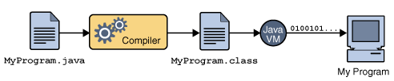

# 🦾 JVM
## 📚Table of Contents

> JVM이란?

> Class Loader

> Runtime Data Area

  

### JVM이란?
> Java Virtual Machine, '자바를 실행하기 위한 가상 기계'라고 할 수 있다.
자바는 운영체제에 종속적이지 않다. Os에 종속받지 않고 실행되기 위해선 OS위에서 Java를 실행 시킬 무언가가 필요한데, 그것이 바로 JVM이다.
`OS에 종속받지 않고 CPU가 Java를 실행할 수 있게 하는 가상 컴퓨터이다.`

> 

## 🦾ClassLoader

  

## 🦾Runtime Data Area

  

## 📚참고

[JVM](https://doozi0316.tistory.com/entry/1%EC%A3%BC%EC%B0%A8-JVM%EC%9D%80-%EB%AC%B4%EC%97%87%EC%9D%B4%EB%A9%B0-%EC%9E%90%EB%B0%94-%EC%BD%94%EB%93%9C%EB%8A%94-%EC%96%B4%EB%96%BB%EA%B2%8C-%EC%8B%A4%ED%96%89%ED%95%98%EB%8A%94-%EA%B2%83%EC%9D%B8%EA%B0%80)