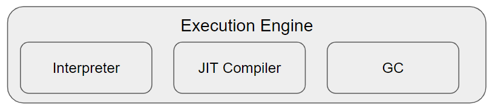
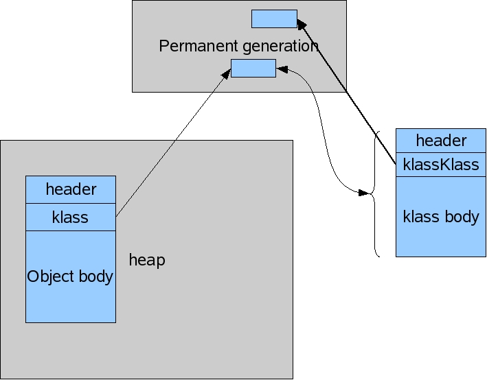

# Execution Engine & Garbage Collection

> Execution Engine    
JVM의 Heap 영역    
Garbage Collection(GC)  
> 

<br/>

# *Execution Engine*

javac가 컴파일한 바이트코드를 Class Loader를 이용해 Runtime Data Area에 실행가능한 상태로 적재한다. 이 때 `Execution Engine(실행 엔진)`은 Runtime Data Area에 적재된 바이트코드를 실행하는 역할을 수행한다.

<br/>

> Execution Engine의 구성 요소
> 



Execution Engine은 `Interpreter`, `JIT(Just-In-Time) Compiler`, `Garbage Collector` 로 구성되어 있다.

1. `Interpreter`
    
    바이트코드를 기계가 이해할 수 있는 Native Code로 변환하는 작업을 수행한다. 바이트코드에 대한 해석은 기본적으로 Interpreter 방식으로 진행된다.
    
    - 바이트코드를 한 줄 씩 읽어서 해석하기 때문에 속도가 느리다.
    - Interpreter는 중복된 바이트코드에 대해서도 변환 작업을 수행하기 때문에 비효율적이다. 따라서 중복된 바이트코드에 대해서는 JIT Compiler를 사용한다
2. `JIT Compiler`
    
    Interpreter의 효율을 높히기 위해서 JVM이 일정 수준 이상으로 반복되어 나타나는 바이트코드를 발견하면 JIT Compiler에 의해 반복된 코드들은 한번에 Native Code로 변환한다.
    
    - 바이트코드에서 `foo()` 메소드가 여러번 중복되면, JIT Compiler가 `foo()` 메소드를 Native Code로 변환한다.
        
        Native Code는 캐시에 보관되기 때문에 JIT Compiler가 한번 컴파일 해두면 빠르게 수행된다
        
    - JIT Comple 과정은 Interpreter 방식보다 오래걸린다.
        
        따라서 한번만 실행되는 코드의 경우 Interpreter 방식을 사용하고, 여러번 실행되는 코드는 JIT Compiler 방식을 사용하는게 바람직하다
        
3. `Garbage Collector`
    
    Runtime Data Area의 Heap 영역에서 더 이상 참조되지 않는 Unreachable 객체의 메모리를 해제하는 역할을 수행한다.
    

<br/>

<br/>

# *JVM의 Heap 영역*

Heap의 구성과 GC 방식은 JVM vendor(공급 업체)의 재량이다. 앞으로 언급하는 JVM의 Heap과 GC 방식은 Oracle Vendor의 HotSpot JVM과 GC 방식이다.

<br/>

> JVM의 Heap 영역
> 


JVM이 운영체제로부터 할당받은 메모리 영역인 `Runtime Data Area` 에 `Heap` 영역이 존재한다.

Heap영역은 JVM이 관리하는 프로그램 상에서 인스턴스/객체가 동적(new)으로 할당되는 영역이다. ***이렇게 Heap 영역에 생성되는 인스턴스는 Stack 영역의 변수/객체에 의해 참조된다.***

<br/>

> 인스턴스 생성 시 일어나는 과정
> 


1. 생성하려 하는 Class Object가 Heap에 존재하는지 확인한다
2. 없다면, Class Object를 Heap에 생성하고 해당 Class에 대한 Data(Class Data)를 Method Area에 저장한다
3. 이 후 JVM은 해당 Class Object의 새로운 인스턴스(Object)를 Heap에 생성하고, Method Area의 Class Data를 가리킨다
4. (Heap에 해당 Class Object가 존재하고 Method Area 영역에 Class Data가 존재하는 상황에서) 해당 Class Object의 새로운 인스턴스가 생성한다면, Heap에 해당 Class Object의 새로운 인스턴스(Object)만 생성시킨다.

<br/>

<br/>

# Garbage Collection(GC)

> GC가 왜 필요할까?
> 

Java는 코드에서 메모리를 명시적으로 지정할 뿐 이를 해제하지 않는다. 따라서 Garbage Collector가 더이상 필요없는(Unreachable) 쓰레기(Garbage) 객체를 찾아 메모리를 해제해주는 Garbage Collection 작업이 필요하다

- 가끔 할당받은 메모리를 명시적으로 해제하기 위해 객체를 null로 지정하거나 `System.gc()` 메소드를 호출하기도한다.
    
    객체를 null로 지정하는 것은 큰 문제가 아니지만, `System.gc()` 메소드를 호출하는 것은 시스템 성능에 매우 큰 영향을 미치기 때문에 절대로 사용하면 안된다.
    

<br/>

> 자신을 참조하는 변수/객체가 없다면(Unreachable 하다면) → Garbage Collection(GC)의 대상
> 

Heap 영역에 생성된 인스턴스/객체를 참조하는 다른 변수/객체가 없다면 Garbage Collector가 해당 인스턴스/객체를 Heap 영역에서 삭제한다. 이를 `Garbage Collection`(GC) 이라 한다.

```java
String a = "https";
a += "www.example.com"; 
```

`"https"` 이라는 String 객체는 Heap 영역에 생성되었지만 `+=` 연산이 실행되면서 더이상 a변수의 참조를 받지 않는다. `"https"` 처럼 더이상 참조를 받지 않는 객체를 `Unreachable 객체` 라고 부른다.

<br/>

> stop-the-world
> 

`stop-the-world`란 GC를 실행하기 위해 JVM이 어플리케이션 실행을 멈추는 것을 말한다. 즉, GC를 실행하는 쓰레드를 제외한 나머지 쓰레드의 작업을 멈추는 것이다.

- GC 작업이 완료된 이후에야 중단했던 작업을 다시 시작한다.
- GC 알고리즘은 여러가지가 있는데, 모두 stop-the-world가 발생한다. stop-the-world 시간은 GC 튜닝을 통해 줄일 수 있다.

<br/>

> GC가 발생하는 영역 → Heap의 `Young Generation 영역` , `Old Generation 영역`
> 


`***Weak Generational Hypothesis` 전제조건을 바탕으로 GC가 발생하는 영역을  2개의 물리적 공간(Young, Old Generation 영역)으로 나누었다.***

`Weak Generational Hypothesis` 전제조건이란 다음과 같다

1. 대부분의 객체는 금방 접근 불가능한(Unreachable) 상태가 된다.
2. Old 영역의 객체에서 Young 영역의 객체로의 참조는 매우 드물다.

<br/>

## 📌 Young Generation 영역

> Young Generation = Eden + Survivor0 + Survivor1
> 

새롭게 생성된 객체의 대부분은 `Young Gen 영역`에 할당된다. 

- 대부분의 객체는 금방 Unreachable한 생타개 되기 때문에 Young Gen 영역에서 생성되었다가 사라진다.

<br/>

> Eden 영역
> 

Object가 최초로 할당되는 영역이다. 만약 Eden 영역이 가득 차면 Minor GC가 일어나고 Minor GC에서 살아남은 Object(LiveObject)는 Survivor 영역으로 옮겨진다.

- Minor GC에서 살아남는 객체란 Stack 영역의 변수나 객체에 의해 참조를 받는 객체를 의미한다.

<br/>

> Survivor 영역
> 

Eden 영역에서 살아남은 Object가 잠시 머무는 영역이다. 하나의 Survivor 영역이 가득차면 Minor GC가 발생하고 살아남은 Object가 다른 Survivor 영역으로 이동한다. 

- 이 때, Minor GC전에 가득찼었던 Survivor 영역은 아무 데이터도 없는 상태가 된다

**Survivor0 → Survivor1/Survivor0 ← Survivor1** 과정을 반복하다 계속 살아남은 Object는 Old Gen영역으로 옮겨진다

<br/>

### 🧩 Minor GC

Young Gen 영역에서 발생하는 Garbage Collection을 `Minor GC` 라고 한다.

> ***Eden & Survivor0 & Survivor1 영역의 처리 절차***
> 


1. 새로 생성된 객체는 대부분 Eden 영역에 위치한다
2. Eden 영역에서 Minor GC가 발생한 후 살아남은 객체는 Survivor 영역 중 하나로 이동한다
3. 이후에 Eden 영역에서 여러 번의 Minor GC가 발생하여 Survivor영역에 객체가 쌓인다
4. **하나의 Survivor 영역**이 가득차면, Minor GC가 발생하고 그 중 살아남은 객체들은 **또 다른 Survivor 영역**으로 옮겨진다. 
    - 하나의 Survivor 영역에서 또 다른 Survivor 영역으로 옮겨질 때마다 해당 객체의 age값이 증가한다.
    - Survivor 영역 중 하나는 반드시 비어있는 상태로 남아있어야 한다. 두 영역에 모두 객체가 존재하거나 사용량이 0이라면 비정상적인 상태이다.
5. `1 ~ 4` 번 과정을 반복하다가 객체의 age값이 일정 수준 이상이 되면 Old Gen 영역으로 이동한다. 이 단계를 `Promotion` 이라고 한다.
    
    Minor GC가 반복적으로 일어나면서 Promotion도 꾸준히 발생한다. Promotion 작업이 반복되어 Old Gen 영역에 객체가 가득차면 Major GC가 발생한다.
    

<br/>

> HotSpot JVM에서 빠른 메모리 할당을 위해 사용하는 2가지 기술
> 
1. `bump-the-pointer`
    
    마지막 객체는 Eden 영역의 맨 위(top)에 존재하는데, `bump-the-pointer` 란 top위치에 있는 객체를 가리키는 포인터이다.
    
    - Eden 영역에 마지막으로 할당된 객체를 추적하는 기술이다.
    - 다음에 생성되는 객체가 있을 때, Eden 영역에 가용공간이 있는지 확인하기 위해 bump-the-pointer를 활용하여 top에 위치한 객체만 점검하고 Eden에 넣을 수 있을지 확인한다.
2. `TLABS(Thread-Local Allocation Buffers)`
    
    멀티 스레드 환경에서 여러 스레드가 bump-the-pointer에 접근하기 때문에 Locking 기법이 사용된다. 하지만 Locking 기법으로 인해 메모리 할당 성능이 매우 떨어져 HotSpot JVM에서는 `TLABS` 기술을 사용한다.
    
    각각의 스레드마다 독립적으로 Eden 영역의 일부(TLABS)를 부여하여 Locking 없이 bump-the-pointer를 활용하여 빠른 메모리 할당이 가능해진다.
    

<br/>

## 📌 Old Generation 영역

Young Gen 영역에서 살아남은 객체는 `Old Gen 영역`으로 복사된다.

- Old Gen 영역은 대부분 Young Gen 영역보다 크기가 크고, 크기가 큰만큼 GC가 적게 발생한다

<br/>

### 🧩 Major GC

Old Gen 영역에서 발생하는 Garbage Collection을 `Minor GC` 라고 한다.

- Old Gen 영역에 데이터가 가득찰 때에만 Major GC가 발생한다.

<br/>

> Old Gen의 Card Table → Young Gen을 위한 것
> 


Old Gen 영역의 객체가 Young Gen 영역의 객체를 참조하는 경우, 512byte의 `Card Table` 에 표시하여 Minor GC의 속도를 빠르게 해주어 전반적인 GC 시간을 줄여준다. 

- 약간의 오버헤드가 있지만 Minor GC과정에서 Young Gen 영역의 객체를 참조하는 Old Gen 영역의 객체가 존재하는지 확인하기 위해 Card Table를 활용한다.
    
    Old Gen 영역의 모든 객체의 참조관계를 하나씩 확인하지 않고 Card Table의 정보만으로 Young Gen 영역의 특정 객체가 GC 대상에 포함되는지 식별할 수 있다.
    

<br/>

> ***JDK7 기준으로 Major GC 를 담당하는 Garbage Collector에는 5가지가 존재한다***
> 
1. Serial GC
2. Parallel GC
3. Parallel Old GC (Parallel Compacting GC)
4. Concurrent Mark & Sweep GC (CMS GC)
5. G1 (Garbage First) GC

<br/>

### ✅`Serial GC (-XX:+UseSerialGC)`

Java SE 5,6의 기본 Garbage Collector이다.

- Minor GC와 Major GC는 순차적으로 실행된다
    - Minor GC는 앞서 설명한 방식으로 실행된다
    - Major GC는 `Mark-Sweep-Compact 알고리즘`을 사용하여 실행된다

> Mark-Sweep-Compact 알고리즘
> 


`Mark-Sweep-Compact 알고리즘` 이란 새로운 객체에 메모리 할당을 빠르게 하기 위해서 기존 메모리에 존재하는 객체들을 Heap 영역의 시작 위치서부터 차례대로 옮겨놓는 알고리즘이다.

- Mark → Old Gen 영역에서 살아있는 객체를 식별하는 과정
- Sweep → Heap 의 시작 위치부터 살아있는 객체만 남겨두고 Unreachable 객체들을 지우는 과정
- Compact → Heap의 시작 위치서부터 객체들이 연속적으로 위치하도록 채우는 과정 (Compact 과정이 수행되면 객체가 존재하는 부분과 존재하지 않는 부분으로 나뉜다)

<br/>

### ✅`Parallel GC (-XX:+UseParallelGC)`

Parallel GC은 Serial GC와 기본적인 알고리즘은 동일하다.

> Parallel GC와 Serial GC의 차이점
> 


- Serial GC는 GC를 수행하는 쓰레드가 오직 하나 뿐이다 (Single Thread)
- Parallel GC는 GC를 수행하는 쓰레드가 여러 개이다 (Multi Thread). 따라서 Serial GC보다 빠르게 Garbage Collection을 수행할 수 있다.

<br/>

### ✅`Parallel Old GC(-XX:+UseParallelOldGC)`

“JDK 5 update 6” 부터 제공하는 GC이다

- Parallel GC와 비교하면 Major GC에서 사용하는 알고리즘만 다르다
    - Parallel GC는 Mark-Sweep-Compact 알고리즘을 사용하지만, Parallel Old GC는 `Mark-Summary-Compaction` 알고리즘을 사용한다.

> Mark-Summary-Compaction 알고리즘의 Summary 단계
> 

Summary 단계는 Major GC를 수행한 영역에서 살아남은 객체를 식별한다. (Sweep과 다르다)

<br/>

### ✅`CMS GC (-XX:+UseConcMarkSweepGC)`

CMS GC는 복잡하다

> CMS GC의 Garbage Collection 과정 : Concurrent Mark-Sweep
> 
1. `Initial Mark`
    
    Class Loader에서 가장 가까운 객체 중 살아있는 객체만 찾는 과정이다
    
2. `Concurrent Mark`
    
    Initial Mark에서 확인한 살아있는 객체가 참조하고 있는 객체들을 재귀적으로 따라가면서 확인하는 과정이다. 멀티 스레드 환경에서 동시에(Concurrent) 진행된다.
    
3. `Remark`
    
    Concurrent Mark에서 새롭게 추가되거나 참조가 끊긴 객체를 확인하는 과정이다
    
4. `Concurrent Sweep`
    
    Unreachable 객체를 정리하는 단계이다. 이 또한 멀티 스레드 환경에서 동시에 진행된다.
    

> 장단점
> 
- 장점
    - CMS GC는 stop-the-world 시간이 짧다
- 단점
    - 다른 GC 방식보다 메모리와 CPU를 더 사용한다.
    - Compaction 단계가 기본적으로 수행되지 않기 때문에 조각난 메모리가 많아질 수 있다. 이는 결국 다른 GC 방식보다 stop-the-world 시간을 더 걸리게 할 수 있다.

<br/>

### ✅`G1 GC`

G1 GC는 CMS GC를 대체하기 위해 만들어진 Garbage Collector이다. G1 GC를 이해하기 위해 기존의 Young Gen, Old Gen 영역에 대해서 잊어야 한다.

- Eden → SurvivorX → SurvivorY → Old Gen 영역으로 객체가 이동하는 단계가 사라진 Garbage Collection 방식이다.
- JDK7에서 정식으로 제공하는 GC이다.

> G1 GC의 Garbage Collection 과정
> 


1. 바둑판의 각 영역에 객체를 할당한다.
2. 객체를 할당하려는 영역이 가득찼다면, 다른 영역에 해당 객체를 할당하고 가득찬 영역에 Major GC를 수행한다.

> 장점
> 

다른 Garbage Collector들 보다 더 좋은 성능을 가지고 있다.

> G1 GC와 CMS GC의 차이점
> 
- G1 GC : Heap 영역을 바둑판 모양의 N개의 영역으로 쪼개어 각 영역에 Major GC를 진행한다
- CMS GC : Heap 영역 전체를 Concurrent Mark-Sweep을 하여 Major GC를 진행한다.

<br/>

<br/>

## 📌 Permanent Generation 영역(Non-Heap 영역)

`Perm Gen 영역`은 클래스, 메소드의 메타정보, static 변수 및 상수 정보가 저장되는 영역이다.

> Perm Gen 영역의 탄생
> 

Perm Gen 영역은 생명주기가 길다고 판단되는 객체들을 Perm Gen 영역에 할당하여 GC 대상에서 제외하기 위해 만들어졌다.

- 생명주기가 길다고 판단되는 객체들 : Class 객체, String 객체

<br/>

> ***Java 8부터 Perm Gen 영역이 사라지고 MetaSpace가 생겼다***
> 

Java 8부터 Perm Gen 영역이 사라지고 `MetaSpace`가 생겼다


Java8 이전에는 static 객체를 남용하고, Class와 Method의 메타데이터가 증가하여`java.lang.OutOfMemoryError: PermGen space` 가 발생했었다. 그래서 메타데이터는 `MetaSpace`에 저장하고, Class, String 객체들을 Heap 영역에 할당하여 GC 대상이 되도록 수정하였다.

그리고 MetaSpace 영역은 Heap이 아닌 Native Memory 영역으로 취급한다.

- Heap 영역은 JVM에 의해 관리되는 영역이고
- Native Memory 영역은 OS 레벨에서 관리하는 영역이다

<br/>

> ***그럼 Java8 이전에 Perm Gen 영역은 Heap 영역에 포함되었을까? → NO***
> 

OutOfMemoryError 에러메시지를 통해 간접적으로 확인할 수 있다.

- Heap 영역이 부족할 때 `java.lang.OutOfMemoryError: Heap space space` 에러가 발생하고, PermGen 영역이 부족하면 `java.lang.OutOfMemoryError: PermGen space` 에러가 발생한다.



또한 3개의 Oracle 공식 문서를 보면 PermGen이 Heap 영역에 포함되지 않는다고 말한다. ([참고](https://stackoverflow.com/questions/41358895/permgen-is-part-of-heap-or-not))

<br/>

# 참고

**[[naver d2] JVM Internal](https://d2.naver.com/helloworld/1230)**

[Perm Gen은 Non-Heap 영역](https://stackoverflow.com/questions/41358895/permgen-is-part-of-heap-or-not)

**[[naver d2] Java Garbage Collection](https://d2.naver.com/helloworld/1329)**

****[자바 메모리 관리 - 가비지 컬렉션](https://yaboong.github.io/java/2018/06/09/java-garbage-collection/)****

**[[JAVA] JVM Execution Engine (실행엔진)](https://joomn11.tistory.com/17)**

# 면접 예상 질문