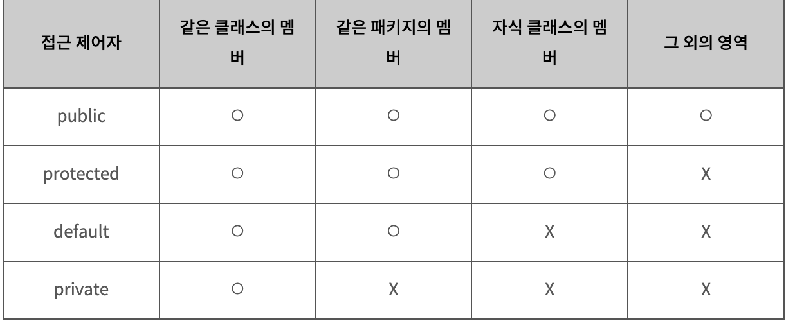

# 🎮OOP

## 📚 Table of Contents

> OOP 객체 지향 프로그래밍이란?

>> 클래스와 객체

>> 생성자

>> OOP의 4가지 특징

> SOLID 원칙

<br><br>

## 객체 지향 프로그래밍이란?
객체 지향 프로그래밍이 등장하기 전에는 프로그래밍의 설계 수준이나 수요에 따른 구조가 복잡한 편이 아니었다. 점점 복잡한 어플리케이션의 설계가 필요했고 이에 따라 실제 세계와 비슷한 모델링 방식이 요구됐다. 그래서 나타난 것이 객체 지향 프로그래밍(Object Oriented Programming)이다. OOP의 핵심은 객체와 클래스라고 할 수 있다. 이들은 실제 개체와 같은 `데이터`와 `행동`이라는 2가지 특징을 가지고 있다.

```
데이터 - 객체의 속성과 상태
행동 - 스스로 변하고 다른 물체와 소통
```

### 클래스와 객체
객체는 클래스의 인스턴스이다. 각각의 객체는 상태, 행동 그리고 식별자를 갖고 있다. 또한 객체들은 서로간의 호출을 통해 통신할 수 있으며 이를 message passing이라고 한다.
하나의 클래스를 통해 필요로 하는 어플리케이션에 여러개의 객체를 생성할 수 있다.

### 생성자
생성자는 반환 값이 없는 특수한 메서드이다. 생성자의 이름은 항상 클래스의 이름과 동일하고 초기 객체 상태를 설정하기 위한 매개 변수를 사용할 수도 있다. 생성자를 작성하지 않는 경우 JVM은 기본 생성자를 할당하며 이는 매개변수를 허용하지 않기 떄문에 매개변수가 필요한 경우에는 개발자가 직접 생성자를 작성해야 한다.

<br>

### OOP의 4가지 특징
- 추상화(Abstration)
- 캡슐화(Encapsulation)
- 다형성(Polymorphism)
- 상속성(Inheritance)
=> 다음과 같은 특징으로 인해 코드의 재사용성을 증가하고 유지보수를 쉽게 하기 위해 객체지향적으로 프로그래밍을 한다고 보면 된다.

#### 추상화
추상화는 컨텍스트와 관련이 없는 정보를 숨기거나 관련된 정보만 알 수 있도록 하는 것이다.

추상화는 데이터 추상화, 제어 추상화 두 가지가 있다.

데이터 추상화는 복잡한 데이터 형태를 생성하기 위해 여러 작은 데이터 타입을 사용하는 방법을 의미
```java
public class Shape
{
    private Rectangle rec;
    private Circle cir;
    private Triangle tri;
    ...
}
```

```java
public class changeShape{
    public static circleToTriagle(){
        ...
    }
}
```

#### 캡슐화
자바의 접근 제어지
- public
- protected
- default
- private 



캡슐화는 관련이 있는 변수와 함수를 하나의 클래스로 묶고 외부에서 쉽게 접근하지 못하도록 은닉하는 것입니다. 객체의 직접적인 접근을 막고 외부에서 내부의 정보에 직접 접근하거나 변경할 수 없고 객체가 제공하는 필드와 메소드를 통해서만 접근이 가능합니다. 캡슐화에는 정보은닉과 구현은닉을 모두 갖고 있다.

정보은닉 방법으로는 접근제어자를 사용하여 외부에서 접근할 수 없도록 하며 인터페이스를 통해 구현은닉을 달성하는 것입니다. 
구현은닉은 객체가 책임을 이행하는 방식을 수정할 수 있도록 개발자에게 자유를 제공한다. 이는 설계가 변경 될 때 유용하게 작용할 수 있다.

```java
//캡슐화 클래스
package com.encapsulationExample;

public class EncapsulationClass {
    private int id;
    private String name;

    public int getId() {
        return id;
    }

    public void setId(int id) {
        this.id = id;
    }

    public String getName() {
        return name;
    }

    public void setName(String name) {
        this.name = name;
    }
}

//메인
package com.encapsulationExample;

public class Main {

    public static void main(String[] args) {
	// write your code here
        EncapsulationClass cap = new EncapsulationClass();

        cap.setId(123);
        cap.setName("jay");

        System.out.println(cap.getId());
        System.out.println(cap.getName());
    }
}

//출력
123
jay
```

#### 다형성
다형성은 같은 자료형에 여러가지 객체를 대입하여 다양한 결과를 얻어내는 성질을 의미한다. 이를 통해 동일한 이름을 같은 여러 형태의 메소드를 만들 수 있다. compile time polymorphism, runtime polymorphism 두가지가 있다.

compile time은 컴팔일러가 필요한 모든 정보를 가지고 있고 프로그램 컴파일 중에 호출할 방법을 알기 때문에 컴파일 시간에 적절한 메소드를 각각의 객체에 바인딩할 수 있다.

runtime은 동적 바인딩으로 불리고 메소드 오버라이딩과 연관있다. 런타임 다형성은 부모 클래스와 자식 클래스가 존재할 때 사용되는데 부모 자식 클래스에 존재하는 메소드를 실행시키게 되면 런타임 과정에서 해당 인스턴스에 맞는 메소드를 호출하게 된다.

```java
class Animal {
    public void sound(){
        System.out.println("Sound...");
    }
}
class Dog extends Animal{
    public void sound(){
        System.out.println("war war");
    }
}
class cat extends Animal{
    ...
}
public static void main(String[] args){
    Animal animal = new Animal();
    animal.sound(); // Sound ...

    Animal animal = new Dog();
    abunal.sound(); // war war
}
```

#### 상속성
상속은 하나의 클래스가 부모클래스의 속성과 행동을 얻게되는 방법으로 상속은 코드의 재사용성과 유지보수를 위해 사용된다. 상속을 사용하기 위해서는 extends 키워드를 상속 받을 클래스에 명시하여 사용할 수 있다. 상속되는 클래스는 super 클래스라 부르고 새롭게 생성된 클래스를 sub 클래스라 한다.

```java
class 자식클래스 extends 부모클래스 {
	//필드
	//생성자
	//메소드
}
//부모 클래스로 Extend하는 것이지 자식클래스를 부모 클래스가 Extend하는 것이 아님.
```


<br><br>

### OOP를 실세계에 빗대어 보면
1. OOP 4대 특성 :주방도구(utensil)
    - 추상화, 상속, 캡슐화, 다형성
2. OOㅇ(객체 지향 설계) 5원칙 :주방 도구 설명서
    - SOLID
3. DP(디자인 패턴) :레시피

## SOLID 원칙(OOD 설계 원칙)

- SRP(Single Responsibility Principle) 단일 책임 원칙
- OCP(Open Close Principle) 개발 폐쇄의 원칙
- LSP(Liskov Substitution Priciple) 리스코브 치환의 원칙
- ISP(Interface Segregation Principle) 인터페이스 분리의 원칙
- DIP(Dependency Inversion Principle) 의존성 역전의 원칙

### SRP(Single Responsibility Principle) 단일 책임 원칙
- 클래스는 단 하나의 기능만을 가진다.
- 클래스의 변경 사유는 단 한가지여야 한다.

### OCP(Open Close Principle) 개발 폐쇄의 원칙
### LSP(Liskov Substitution Priciple) 리스코브 치환의 원칙
### ISP(Interface Segregation Principle) 인터페이스 분리의 원칙
### DIP(Dependency Inversion Principle) 의존성 역전의 원칙


<br><br>

## 📚 참고

[OOP](https://velog.io/@vincentj2/JAVA-OOP%EB%9E%80)

[OOP 특징](https://limkydev.tistory.com/30)

[OOP](https://javaoop.tistory.com/25)

[SOLID 원칙](https://sehun-kim.github.io/sehun/solid/)

[SOLID](https://velog.io/@ehddek/OOD%EA%B0%9D%EC%B2%B4-%EC%A7%80%ED%96%A5-%EC%84%A4%EA%B3%84%EC%9B%90%EC%B9%99SOLID)

<br>

## ⁉️ 면접 예상 질문
