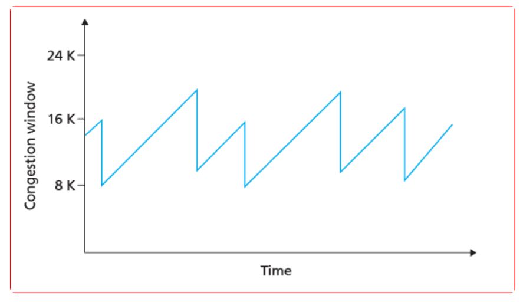
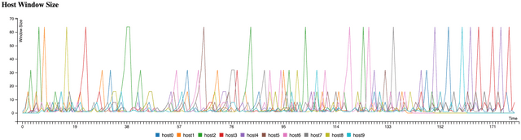

# TCP & UDP + QUIC

> TCP

> 흐름제어

> 혼잡제어

> 오류제어

> UDP

> TCP vs UDP

> QUIC

## 전송 계층(Transport layer)
전송 계층은 송신자와 수신자를 연결하는 통신 서비스를 제공하는 계층으로, 쉽게 말해 데이터의 전달을 담당한다. 

이 계층에서는 IP에 의해 전달되는 패킷의 오류를 검사하고 재전송 요구 등의 제어를 담당한다.

전송 계층에서 데이터를 전달하기 위해 사용하는 프로토콜에는 `TCP`와 `UDP`가 있다.

## TCP(Transmission Control Protocol) 
**전송 제어 프로토콜**
TCP는 전송 계층에서 사용하는 프로토콜로서, 장치들 사이에 논리적인 접속을 성립하기 위하여 연결을 설정하여 **신뢰성을 보장하는 연결형 서비스**이다. 

TCP는 네트워크에 연결된 컴퓨터에서 실행되는 프로그램 간에 패킷을 안정적으로, 순서대로, 에러 없이 교환할 수 있게 한다. 

> relialble network를 보장한다는 것은 4가지 문제점 존재
1. 손실: 패킷이 손실될 수 있는 문제
2. 순서 바뀜: 패킷의 순서가 바뀌는 문제
3. congestion: 네트워크가 혼잡한 문제
4. overload: 수신자가 overload되는 문제

### TCP의 특징
1. 연결형 서비스로 가상  회선 방식을 제공한다.
    - 3-way handshaking 과정을 통해 연결을 설정한다.
    - 4-way handshaking 과정을 통해 연결을 해제한다. 

2. 흐름 제어
    - 송신측과 수신측의 데이터 처리 속도 차이를 해결하기 위한 기법
    - Flow Control은 수신자가 패킷을 지나치게 많이 받지 않도록 조절하는 것
    - 기본 개념은 수신자가 송신자에게 현재 자신의 상태를 feedback 한다는 것

3. 혼잡 제어
    - 송신측의 데이터 전달과 네트워크의 데이터 처리 속도 차이를 해결하기 위한 기법

4. 신뢰성이 높은 전송
송신 측에서 보낸 패킷을 수신 측에서 받지 못하면 재전송한다. 
- Dup ACK-based retransmission: 송신 측에서 여러 개의 세그먼트를 전송했는데, 수신된 세그먼트의 순서가 틀렸을 경우 수신 단말이 다시 보내달라는 의미로 ACK를 보낸다. 송신 측에서 동일한 ACK를 3개 이상 받았을 경우 해당 패킷은 손실됏따고 판단해 재전송을 요청한다.
- Timeout-based retransmission: 송신자는 일정 시간동안 수신자로부터 ACK를 받지 못하면 손실됐다고 판단해 재전송을 요청한다. 
   
5. 점이중, 점대점 방식
    - 점이중(Full-Duplex): 데이터 전송 흐름 방향이 항상 양 방향으로 동시에 전송할 수 있다.
    - 점대점(Point to Point): 각 연결이 정확히 2개의 종단점을 가지고 있다. 

### 전송의 전체 과정
- Application layer: sender application layer가 socket에 data를 쓴다.
- Transport layer: data를 segment로 감싼다. 그리고 network layer에 넘겨준다.
- 그러면 아랫단에서 receiving node로 전송이 된다. 이때 sender의 send buffer에 data를 저장하고, receiver는 receive buffer에 data를 저장한다.
- application에서 준비가 되면 이 buffer에 있는 것을 읽기 시작한다.
- flow control의 핵심은 receiver buffer가 넘치지 않게 하는 것이다. 
- receiver는 RWND(Receive WiNDow):receive buffer의 남은 공간을 홍보한다. 

## 💡 흐름제어(Flow Control)
- 수신측이 송신측보다 데이터 처리 속도가 빠르면 문제없지만, 송신측의 속도가 빠를 경우 문제가 생긴다.
- 수신측에서 제한된 저장 용량을 초과한 이루에 도착하는 데이터는 손실 될 수 있으며, 만약 손실 된다면 불필요하게 응답과 데이터 전송이 송/수신 측 간에 빈번이 발생한다. 
- 이러한 위험을 줄이기 위해 송신 측의 데이터 전송량을 수신측에 따라 조절해야한다.

흐름제어는 위와 같이 송신측과 수신측의 TCP 버퍼 크기 차이로 인해 생기는 데이터 처리 속도 차이를 해결하기 위한 기법이다.

> TCP 버퍼
> 송신측은 버퍼에 TCP 세그먼트를 보관한 후 순차적으로 전송하고, 수신측은 도착한 TCP 세그먼트를 애플리케이션이 읽을 때까지 버퍼에 보관한다. 

**해결 방법**
### 1. Stop and Wait 
매번 전송한 패킷에 대해 확인 응답을 받아야만 그 다음 패킷을 전송하는 방법 

패킷을 하나씩 보내기 때문에 비효율적인 방법이다. 

### 2. Sliding Window 
 - 수신측에서 설정한 윈도우 크기만큼 송신측에서 확인응답없이 세그먼트를 전송할 수 있게 하여 데이터 흐름을 동적으로 조절하는 제어 기법

> 윈도우: 송신, 수신 스테이션 양쪽에서 만들어진 버퍼의 크기

> 호스트들은 실제 데이터를 보내기 전에 `3-way handshakeing`을 통해 수신 호스트의 receive window size에 자신의 send window size를 맞추게 된다.  

### 동작 방식
윈도우에 포함된 패킷을 계속 전송하고 수신 측으로부터 확인 응답(ACK)이 오면 윈도우를 옆으로 옮겨 다음 패킷들을 전송한다. 

- 최초로 수신자는 윈도우 사이즈를 7로 정한다.
- 송신자는 수신자의 확인 응답(ACK)를 받기 전까지 데이터를 보낸다.
- 수신자는 확인 응답을(ACK)을 송신자에게 보내면, 슬라이딩 윈도우 사이즈를 충족할 수 있게  윈도우를 옆으로 옮긴다.
- 이후 데이터를 다 받을 때까지 위 과정을 반복한다. 

**재전송**
- 송신측은 일정 시간 동안 수신측으로부터 확인응답을 받지 못하면, 패킷을 재전송한다.
- 만약 송신측에서 재전송을 했는데 패킷이 소실된 경우가 아니라 수신측의 버퍼에 남는 공간이 없는 경우면 문제가 생긴다.
- 이를 해결하기 위해 수신측은 해결응답을 보내면서 남은 버퍼의 크기(윈도우의 크기)도 함께 보내준다. 

## 💡 오류제어
> ARQ(Automatic Repeat Request): 신뢰성있는 데이터 전달을 위해 재전송을 기반으로한 에러 제어 방식

ARQ 기법을 사용해 프레임이 손상되었거나 손실되었을 경우 재전송을 통해 오류를 복구한다.

**해결 방법**
### 1. Stop and Wait ARQ
데이터나 ACK가 분실되었을 경우 일정 간격의 시간을 두고 타임아웃이 되면 송신측은 데이터를 재전송한다.

### 2. Go Back n ARQ
전송된 프레임이 손상되거나 분실된 경우, 확인된 마지막 프레임 이후로 모두 재전송하는 기법이다. 

## 💡 혼잡제어
데이터의 양이 라우터가 처리할 수 있는 양을 초과하면 초과된 데이터는 라우터가 처리하지 못한다. 이때 송신 측에서는 라우터가 처리하지 못한 데이터를 손실 데이터로 간주하고 계속 재전송하여 네트워크를 혼잡하게 한다.

이런 상황은 송신 측의 전송속도를 적절히 조절하여 예방할 수 있는데, 이것을 혼잡제어라고 한다.

> 정리하자면 `흐름제어`는 송 수신 측 사이의 패킷 수를 제어하는 기능이고, `혼잡제어`는 네트워크 내의 패킷 수를 조절하여 네트워크의 오버플로우를 방지하는 기능이다.

**해결 방법**
### 1. AIMD(Additive Increase/Multicative Decrease)

직역하면 합 증가/ 곱 감소 방식이다. 

AIMD 방식은 처음에 패킷을 하나씩 보내고 문제 없이 도착하면 윈도우의 크기를 1씩 증가시켜가며 전송한다. 만약 전송에 실패하면 윈도우 크기를 반으로 줄인다.

윈도우 크기를 너무 조금씩 늘리기 때문에 네트워크의 모든 대역을 활용하여 제대로 된 속도로 통신하기까지 시간이 오래 걸린다는 단점이 있다. 

### 2. Slow Start (느린 시작)

AIMD 방식은 윈도우 크기를 선형적으로 증가시키기 때문에, 제대로된 속도가 나오기까지 시간이 오래걸린다.

반면 Slow Start는 윈도우의 크기를 1,2,4,8...과 같이 지수적으로 증가시키다가 혼잡이 감지되면 윈도우 크기를 1로 줄이는 방식이다. 

이 방식은 보낸 데이터의 ACK가 도착할때마다 윈도우 크기를 증가시키기 때문에 처음에는 윈도우 크기가 조금 느리게 증가할지라도, 시간이 가면 윈도우 크기가 점점 빠르게 증가한다는 장점이 있다. 

혼잡 윈도우의 크기가 임계치에 도달하기 전까지 적용되며, 임계 값에 도달하면 `혼잡회피 단계`를 수행한다. 

> 임계점(Threshold)
> 여기까지만 `slow start`를 사용하겠다라는 의미를 가진다. `slow start threshold`라고도 한다. 
> 이 값을 사용하는 이유는 윈도우 크기를 지수적으로 증가시키다보면 크기가 기하급수적으로 늘어나 제어가 힘들어지기 때문이다.

### 3. 혼잡회피(Congestion Avoidance)
윈도우의 크기가 임계 값에 도달한 이후에는 데이터 지연, 손실이 발생할 확률이 높아진다. 

따라서 전송 데이터의 크기가 임계점에 도달하면 선형적으로 **1씩 윈도우를 증가**시킨다. 

만약 타임 아웃 문제가 생긴다면 윈도우 크기는 1로 돌아가며 임계점은 손실 이벤트가 발생할 때의 혼잡 윈도우 사이즈의 1/2로 변경된다. 이후 빠른 회복 상태로 들어간다. 

### 4. Fast Retransmit (빠른 재전송)
패킷을 받는 수신자 입장에서는 세그먼트로 분할된 내용들이 순서대로 도착하지 않는 경우가 생길 수 있다. 이런 상황이 발생했을 때 수신 측에서는 순서대로 잘 도착한 마지막 패킷의 다음 순번을 ACK 패킷에 실어서 보낸다. 

그리고 이런 중복 ACK를 3개 받으면 재전송이 이루어진다. 송신 측은 자신이 설정한 타임 아웃 시간이 지나지 않았어도 바로 해당 패킷을 재전송할 수 있기 때문에 보다 빠른 재전송률을 유지할 수 있다. 

또한 혼잡한 상황이라 판단하고 혼잡 윈도우 사이즈는 1로 돌아가며 임계점은 손실 이벤트가 발생할 때의 혼잡 윈도우의 사이즈의 1/2로 변경된다. 

### 5. Fast Recovery(빠른 회복)
혼잡한 상태가 되면 윈도우 크기를 1로 줄이지 않고 반으로 줄이고 선형 증가시키는 방법이다.

만약 타임아웃이 발생하면 혼잡 윈도우 사이즈는 1로 하고, 임계점은 손실 이벤트가 발생할 때의 혼잡 윈도우 사이즈의 1/2로 변경된다. 

## 💡 혼잡제어 정책

... 추가예정

### TCP의 장점
- 데이터를 정확하고 안정적으로 전달할 수 있다.
- 호스트 간 신뢰성 있는 데이터 전달과 흐름제어를 한다. 

### TCP의 단점
- 데이터로 보내기 전에 반드시 연결이 형성 되어야 한다.
- 1:1 통신만 가능하다.
- 고정된 통신 선로가 최단선로(네트워크 길이)가 아닐경우 상대적으로 UDP보다 데이터 전송속도가 느리다.

## UDP
UDP는 전송계층의 **비 연결 지향적 프로토콜**이다. 

데이터를 서로 다른 경로로, 독립적으로 처리하는 프로토콜이다. 

> 비 연결 지향적: 데이터를 주고 받을때 연결 절차를 거치지 않고 발신자가 일방적으로 데이터를 발신하는 방식 

> 데이터를 데이터그램 단위로 처리하는 프로토콜 데이터그램 : 독립적인 관계를 지니는 패킷

### UDP의 특징
- 비 연결형 서비스로 연결 없이 통신이 가능하며 데이터그램 방식을 제공한다. 
- 정보를 주고 받을 때, 정보를 보내거나 받는다는 신호 절차를 거치지 않는다.
- 신뢰성 없는 데이터를 전송한다.
- 패킷 관리가 필요하다.
- 패킷 오버헤드가 적어 네트워크 부하가 감소되는 장점이 있다.
- 상대적으로 TCP보다 전송속도가 빠르다.

### UDP의 장점
- TCP보다 데이터 전송 속도가 빠르다.

### UDP의 단점
- 데이터의 신뢰성이 떨어진다.
- 패킷의 분실 확인이나 전달 순서를 보장해주지 않는다.
- TCP와는 다르게 데이터를 쪼개주지 않아 애플리케이션 단에서 패킷을 쪼개야 한다. 

## UDP를 사용하는 이유
- TCP는 신뢰성을 보장하지만 연결을 통해 시간 손실을 발생할 수 있다.
- TCP는 패킷이 누락되면 재전송을 해야한다.
- 사진 또는 영상은 데이터의 일부가 누락돼도 문제가 발생하지 않기 때문에, TCP는 합리적인 방법이 되지 못한다.
- 위와 같은 경우 전송 속도가 빠른 UDP를 사용한다.

## TCP vs UDP

## QUIC

## ⁉️ 면접 예상 질문
 > 1. TCP와 UDP의 특징과 차이점을 설명해주세요.

 > 2. TCP를 사용하는 대표적인 프로토콜은 무엇인가요?

 > 3. UDP가 어디에 사용되고 왜 사용되나요?

 > 4. TCP/UDP의 장단점은 무엇인가요?

 > 5. 신뢰성있는 TCP를 두고 UDP를 사용하는 이유는 무엇인가요?

 > 6. TCP에서 신뢰성을 보장하는 방법을 설명해주세요.

 > 7. TCP 통신에서 흐름 제어 기법이 왜 사용되나요?

 > 8. TCP 흐름 제어 기법은 무엇이 있을까요?

 > 9. TCP 혼잡 제어 기법은 왜 사용되나요?

 > 10. TCP 혼잡 제어 기법에는 무엇이 있을까요?

 > 11. TCP 혼잡 제어 정책에는 무엇이 있을까요?

