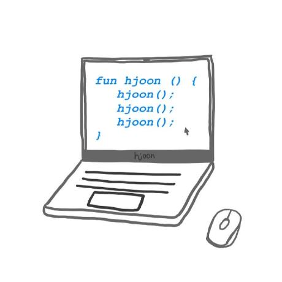

# ✨ CS-study

> 함께 성장하고 각자 목표한 바를 이루기 위한 모임

힘든 취준 기간 동안에 다 같이 으샤으샤하며 같이 성장할 수 있었으면 좋겠습니다. 서로 부족한 부분은 issue를 통해 알려주세요. 🙂
[HowWeRun? 진행방식](info/README.md)

### 💫 Contributors

| **_🌎김지원_**                                                                              | **_🌍김민성_**                                     | **_🌏이현동_**                                                                              | **_🌏하현준_**                                                                             |
| ------------------------------------------------------------------------------------------- | -------------------------------------------------- | ------------------------------------------------------------------------------------------- | ------------------------------------------------------------------------------------------ |
| <p align="center"></p> |                                                    | <p align="center"></p> | <p align="center"></p> |
| [@annie1004619](https://github.com/annie1004619)                                            | [@minseongkim97](https://github.com/minseongkim97) | [@LEEHYUNDONG](https://github.com/LEEHYUNDONG)                                              | [@guswns3371](https://github.com/guswns3371)                                               |


### 📣 내용 구성

- 앞으로의 이론정리는 다음과 같이 이루어집니다.
```본인이 맡은 주제에 해당하는 이론 정리(자세한 버전) + 면접에서 요구하는 이론 (위에서 정리한 이론 요약) + 예상 면접 질문(최소 3개)```


### 👊 Rules

> ✔️ 주제에 본인이 맡은 파트를 링크를 걸어주세요. ✍️

> ✔️✔️ 사진을 첨부할 때는 하나의 img_src 폴더에 넣고 push한 후 링크를 걸어주세요. 🧚

> ✔️✔️ commit 시 message/ git commit -m “Docs:주차\_일자/작성자/주제”


---

### 🏔 Data Structure [Link](CS/DataStructure)

### 🏔 Network [Link](CS/Network)

### 🏔 Database [Link](CS/Database)

### 🏔 OS [Link](CS/OS)

---

## 👊 Schedule/스터디 스케줄

| **과목** | **일자** | **주차** | **주제**|
| ------------- | ---------- | -------- | ---------------------------------------------------------------------------------------------------------------------------------------| 
| 자료구조      | 2022/01/09 | 1주차    | [Array vs. LinkedList](CS/DataStructure/ArrayVSLinkedList.md)<br>[Tree](CS/DataStructure/Tree.md)<br> [Stack and Queue](CS/DataStructure/StackAndQueue.md)<br> [BinaryHeap](CS/DataStructure/Heap.md) |
|자료구조 | 2022/01/16 | 2주차 | [Red-BlackTree](CS/DataStructure/Red-BlackTree.md)<br>[Hash Table](CS/DataStructure/HashTable.md)<br>[Graph1](CS/DataStructure/Graph.md)<br>[Graph2](CS/DataStructure/MinimumSpanningTree.md) |
| 네트워크      | 2022/01/23 | 3, 4주차   | [GET, POST, DELETE 방식](CS/Network/HTTP%20Method.md) <br>[Rest and RestAPI](CS/Network/REST.md)<br>[HTTP와 HTTPS의 차이점 & HTTP문제점](CS/Network/HttpHttps.md) <br>[SSL, 공개키, 대칭키](CS/Network/SSL.md) <br> [TCP 3 way-handshake](CS/Network/TCP_3way_handshake.md)<br>[TCP와 UDP의 차이점 + QUIC](CS/Network/TCP_UDP_QUIC.md)<br>[DNS round robin 방식](https://github.com/CS-studi/CS-study/blob/master/CS/Network/DNSRoundRobin.md)<br>[웹 통신의 큰 흐름](https://github.com/CS-studi/CS-study/blob/master/CS/Network/%EC%9B%B9%ED%86%B5%EC%8B%A0%EC%9D%98%ED%81%B0%ED%9D%90%EB%A6%84.md)|
| 네트워크      | 2022/01/30 | 4주차   |[네트워크 시스템의 Layer and Architecture](CS/Network/Network_Layer_Architecture.md)<br>[쿠키, 세션, jwt 토큰](https://github.com/CS-studi/CS-study/blob/master/CS/Network/CookieSessionJWT.md)<br>프록시<br>[소켓 통신](CS/Network/socket.md)|

<!-- | 운영체제      | 2022/01/01 | 4주차   ||
| 데이터베이스  | 2022/01/01 | 5주차   ||  -->


